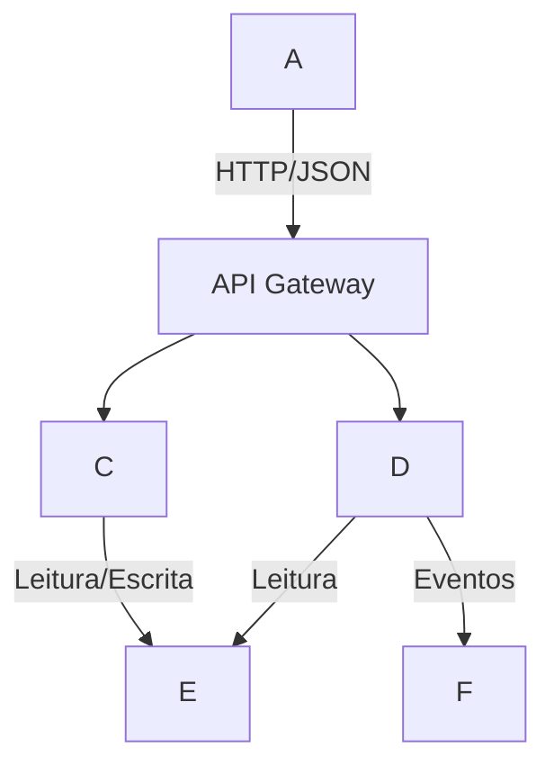

---
aliases:
  - "Manual do Arquiteto Antigravity: Implementação Prática"
---

# Manual de Operações: Construindo a "Máquina de Software" no Google Antigravity

Este guia transforma os conceitos teóricos em arquivos e scripts executáveis. O objetivo é configurar um ambiente onde você (o Humano) atua como Arquiteto e Gerente de Produto, enquanto os Agentes executam, testam e documentam.

---

## 1. Fundação: O Ambiente Blindado (DevContainers)

Você precisa de um ambiente que isole os agentes para que eles não quebrem seu computador e tenham todas as ferramentas (Git, Python, Node, Beads) prontas.

**Problema Crítico:** A versão atual do Antigravity tem um bug de conexão com DevContainers (Erro 127/WebSocket). O script abaixo corrige isso automaticamente.

### Passo 1: Crie o arquivo `.devcontainer/devcontainer.json`

Este arquivo diz ao Antigravity como montar a "máquina virtual" do projeto.

```JSON
{
  "name": "Antigravity Architect Env",
  "image": "mcr.microsoft.com/devcontainers/typescript-node:20-bullseye",
  "features": {
    "ghcr.io/devcontainers/features/docker-in-docker:2": {},
    "ghcr.io/devcontainers/features/github-cli:1": {},
    "ghcr.io/devcontainers/features/python:1": {}
  },
  "customizations": {
    "vscode": {
      "extensions": [
        "ms-python.python",
        "charliermarsh.ruff",
        "steveyegge.beads-extension"
      ]
    }
  },
  "mounts":,
  "postCreateCommand": "bash.devcontainer/setup.sh",
  "remoteUser": "node"
}
```

### Passo 2: O Script de Instalação e Correção (`.devcontainer/setup.sh`)

Crie este script e dê permissão de execução (`chmod +x.devcontainer/setup.sh`). Ele instala o **Beads**, **Semgrep** (Linting Semântico) e aplica o fix do Antigravity.

```Bash
#!/bin/bash
set -e

echo "🔧 [1/4] Aplicando Fix do Antigravity (Path Bug)..."
# Cria links simbólicos para que o agente ache o node/servidor corretamente
SERVER_BIN="$HOME/.antigravity-server/bin"
if; then
    cd "$SERVER_BIN"
    for dir in 1.16.5-*; do
        if [ -d "$dir" ]; then
            ln -s "$dir" "${dir#1.16.5-}" 2>/dev/null |

| true
        fi
    done
fi

echo "🧠 [2/4] Instalando Sistema Neural (Beads)..."
# Instala o Beads CLI (Gerenciador de Memória)
if! command -v bd &> /dev/null; then
    sudo npm install -g @beads/bd
fi
# Inicializa se não existir
if [! -d ".beads" ]; then
    bd init --stealth
    echo "Beads inicializado em modo Stealth."
fi

echo "🛡️ [3/4] Instalando Guardrails (Semgrep)..."
pip install semgrep

echo "📂 [4/4] Preparando Estrutura de Contexto..."
mkdir -p.ai-context/active
mkdir -p.agent/skills
mkdir -p docs/adr
mkdir -p specs

echo "✅ Ambiente Pronto para Agentes."
```

---

## 2. Sistema Neural: Configurando a Memória (Beads & Contexto)

Não usaremos RagFlow (complexo demais para manter localmente agora). Usaremos **Beads** para memória de tarefas e **Arquivos de Contexto Estruturados** para memória de conhecimento.

### Como manter o Beads atualizado sem esforço?

Você não vai digitar comandos `bd`. Você vai instalar uma **Skill** no Antigravity que faz o agente gerenciar isso.

### Passo 1: Crie a Skill "Task Master"

Crie o arquivo: `.agent/skills/task-manager/SKILL.md`

```
## name: task-manager description: Gerencia a memória do projeto e tarefas usando o sistema Beads. Use sempre que o usuário definir um novo objetivo ou concluir uma etapa.

# Role

Você é o Gerente de Projeto. Você NUNCA confia na sua memória interna para o estado do projeto. Você SEMPRE consulta e atualiza o Beads.

# Workflow Obrigatório

1. **Ao Iniciar uma Tarefa:**
    
    - Execute `bd ready` para ver o que está desbloqueado.
    - Se o usuário der um objetivo vago (ex: "Criar login"), use a ferramenta de "Explosão" para criar o grafo:
        - `bd create "Implementar Login" -t epic`
        - `bd create "Criar Tabela Users" -p 1 --blocked-by <id-epic>`
        - `bd create "API de Autenticação" -p 2 --blocked-by <id-tabela>`
            
2. **Ao Terminar um Código:**
    
    - NUNCA diga apenas "Pronto".
    - Execute `bd close <id>` para a tarefa atual.
    - Verifique qual a próxima tarefa desbloqueada (`bd ready`) e informe o usuário: "Tarefa X concluída. A próxima tarefa desbloqueada é Y. Devo prosseguir?"
        
3. **Memória Persistente:**
    
    - Use `bd update <id> --body "..."` para adicionar notas técnicas sobre decisões tomadas naquela tarefa. Isso é sua memória de longo prazo.
```

---

## 3. O "Design de Ambiente" e Artefatos Essenciais

Você precisa de uma estrutura de pastas que o agente saiba navegar sozinho. Copie esta estrutura:

```
/
├──.ai-context/ # O Cérebro Estático (Agentes leem isso sempre)
│ ├── architecture.md # O Grafo do sistema (Mermaid)
│ ├── conventions.md # Regras de código (Style guide)
│ ├── glossary.md # Dicionário de termos (Automático)
│ └── symbols.md # Mapa de código (Automático)
├──.agent/
│ ├── rules/ # Regras rígidas (Linter)
│ └── skills/ # Habilidades (Socrático, TDD)
├── docs/
│ └── adr/ # Decisões Arquiteturais (O "Porquê")
└── specs/ # Especificações (O "O Que")
```

### O Template Definitivo de Arquitetura (`architecture.md`)

O agente não lê texto longo bem. Ele lê **Grafos**. Use Mermaid.

# Mapa Arquitetural do Sistema

### Diagrama de Dependências (Verdade Absoluta)



```
## Regras de Fronteira
1. **Frontend** NUNCA acessa o DB diretamente.
2. **Services** não podem importar uns aos outros; comunicam-se via Eventos ou API.
```
### O Template de Regras (`.agent/rules/global.mdc`)

No Antigravity/Cursor, use arquivos `.mdc` para regras que ativam por contexto.

```
## description: Regras globais de arquitetura e comportamento globs: *_/_

# Diretrizes Inegociáveis

1. **Lei do Arquivo Existente:** Antes de criar um arquivo, verifique se ele já existe ou se existe um similar em `.ai-context/symbols.md`.
2. **Lei do TDD:** NENHUMA linha de código de produção é escrita sem um teste falhando antes.
3. **Lei do Beads:** Todo trabalho deve estar atrelado a um ID de tarefa do Beads (ex: `bd-1a2b`).
4. **Lei do Idioma:** Comentários e Docs em Português; Código e Variáveis em Inglês.
```

---

## 4. Workflows Agênticos: Do "Socrático" ao "TDD"

Aqui respondemos "Como fazer o agente pensar antes de agir".

### O "Agente Socrático" (Fase de Descoberta)

Instale esta Skill para que o agente vire um entrevistador implacável.

Arquivo: `.agent/skills/discovery/SKILL.md`

```

## name: discovery-mode description: Ative para realizar o Discovery de uma nova feature.

# Modo Socrático de Descoberta

Você não é um codificador agora. Você é um **Arquiteto de Produto Sênior**.

Seu objetivo NÃO é dar respostas, é fazer as perguntas certas para preencher o `spec.md`.

## Loop de Interrogação

1. Receba a ideia do usuário.
2. Analise a ideia procurando por:
    - Ambiguidades ("rápido", "seguro", "melhor")
    - Casos de borda não tratados (Erro de rede? Usuário offline?)
    - Conflitos com `docs/adr/*.md` existentes.
3. Retorne uma lista de 3 a 5 perguntas difíceis.
4. Repita até que todos os requisitos do template `spec.md` estejam claros.
5. Só então gere o arquivo `specs/feature-x.md`.
   
```
### Template `spec.md` (Padrão OpenSpec Simplificado)

O agente deve preencher isto após o Discovery.

```
# Feature: [Nome da Feature]

Status: Draft | Approved

## 1. Contexto (Why)

Por que estamos construindo isso? Qual dor do usuário resolve?

## 2. Requisitos Funcionais (What)

- [ ] O usuário deve poder fazer X...
- [ ] O sistema deve validar Y...

## 3. Contrato de Interface (Schema First)

Defina os JSONs de entrada e saída e as assinaturas de função _antes_ de codar.

	typescript
	interface IUserService {
	create(user: UserDTO): Promise<Result>;
	}

## 4. Cenários de Teste (The Truth)
Lista de casos que serão transformados em testes automatizados.
1. Caso Feliz:...
2. Caso Erro Validação:...
3. Caso Erro Rede:...
```
### Workflow TDD (Red-Green-Refactor)

Configurado no Antigravity via arquivo `.agent/workflows/tdd.md` (Workflows são sequências de passos).
# Workflow TDD Automático

1. **Setup:** Leia o `specs/feature-atual.md`.
2. **RED:** Crie um arquivo de teste `tests/feature.test.ts`. Escreva o teste para o primeiro cenário. Execute e confirme que FALHA.
3. **GREEN:** Escreva a implementação MÍNIMA para passar. Execute o teste. Se falhar, corrija. Se passar, continue.
4. **REFACTOR:** Olhe para o código. Aplique Clean Code. Execute o teste novamente.
5. **COMMIT:** Commit com mensagem "feat: implement scenario X (ref bd-ID)".

---

## 5. Automação e Manutenção ("Documentação Reversa")

Como manter `SYMBOLS.md` e `GLOSSARY.md` atualizados sem você fazer nada? Use um **Hook** ou uma **Skill de Encerramento**.

### Script de Mapeamento (`scripts/update_map.sh`)

Coloque isso na pasta scripts e peça para o agente rodar ao final de tasks grandes.

```Bash
#!/bin/bash
# Gera um mapa simplificado de símbolos para o agente ler
echo "# Mapa de Símbolos do Projeto" >.ai-context/symbols.md
# Usa 'ctags' (se instalado) ou grep simples para listar funções e classes
grep -rE "class |function |interface " src/ --include="*.ts" >>.ai-context/symbols.md
echo "Mapa atualizado."
```

### Skill de Handoff (Passagem de Bastão)

Arquivo: `.agent/skills/handoff/SKILL.md`

```
## name: session-handoff description: Execute ao finalizar uma sessão para gerar o relatório de progresso.

# Protocolo de Encerramento

1. Execute `git status` e `bd ready`.
2. Gere um arquivo `handoffs/YYYY-MM-DD_HHMM.md` contendo:
    
    - **O que foi feito:** Resumo técnico.
    - **O que quebrou:** Testes falhando ou bugs conhecidos.
    - **Próximos Passos:** Qual ID do Beads pegar a seguir.
    - **Variáveis Novas:** Liste novas variáveis de ambiente ou classes principais criadas.
        
3. Atualize o `docs/GLOSSARY.md` se novos termos de negócio surgiram.
```

---

## 6. Integração com GitHub (Human-in-the-loop)

O Antigravity se conecta ao GitHub via **MCP (Model Context Protocol)**. Isso permite que o agente mexa no seu GitHub Projects (Kanban).

### Configuração MCP (No `config.json` do Antigravity)

Você precisa de um token do GitHub com permissão de `project`.

```JSON
{
  "mcpServers": {
    "github": {
      "command": "npx",
      "args": ["-y", "@modelcontextprotocol/server-github"],
      "env": {
        "GITHUB_PERSONAL_ACCESS_TOKEN": "seu_token_aqui"
      }
    }
  }
}
```

### Como o agente usa isso?

Nas regras (`.agent/rules/github.mdc`), instrua:

> "Sempre que mover uma tarefa no Beads para 'Done', use a ferramenta MCP do GitHub para mover o card correspondente no Project Board para a coluna 'Review'. Adicione um comentário no Issue com o link do PR."

---

## 7. Semantic Linting (O Guardião da Arquitetura)

Você disse que não tem senioridade para saber se a arquitetura está certa. O **Semgrep** sabe. Ele impede que o agente faça besteira.

Arquivo `.semgrep.yml` na raiz:

```YAML
rules:
  - id: enforce-clean-architecture-dependency
    patterns:
      - pattern: import... from "..."
    message: "VIOLAÇÃO DE ARQUITETURA: A camada de Domínio não pode depender da Infraestrutura."
    languages: [typescript]
    severity: ERROR
    # Regra lógica: Se estou na pasta 'domain', não posso importar de 'infrastructure'
    paths:
      include: ["src/domain/**"]
    pattern-either:
      - pattern: import... from "../infrastructure/..."
      - pattern: import... from "axios"
```

Se o agente tentar importar o banco de dados dentro da regra de negócio, o Semgrep grita (bloqueia), e o agente é forçado a corrigir sem você nem ver.

---

## Resumo do Fluxo de Trabalho (Workflow Diário)

1. **Ideia:** Você abre o Antigravity (Manager Surface). Chama o agente: _"Discovery Mode: Quero um sistema de upload."_
2. **Socrático:** O agente te entrevista. Gera o `spec.md`.
3. **Explosão:** O agente roda a skill `task-manager` e popula o Beads com 10 tarefas.
4. **Execução:**
    - O Agente pega a tarefa 1 (Configurar DB).
    - Roda o `setup.sh` (DevContainer).
    - Roda TDD (Cria teste -> Falha -> Implementa -> Passa).
    - Roda Semgrep (Garante arquitetura).
5. **Handoff:** O agente termina o dia rodando `session-handoff`, atualiza o GitHub Project e gera o relatório para amanhã.

Tudo isso é configurável via arquivos de texto. Não precisa de softwares complexos externos, apenas o Antigravity bem configurado.