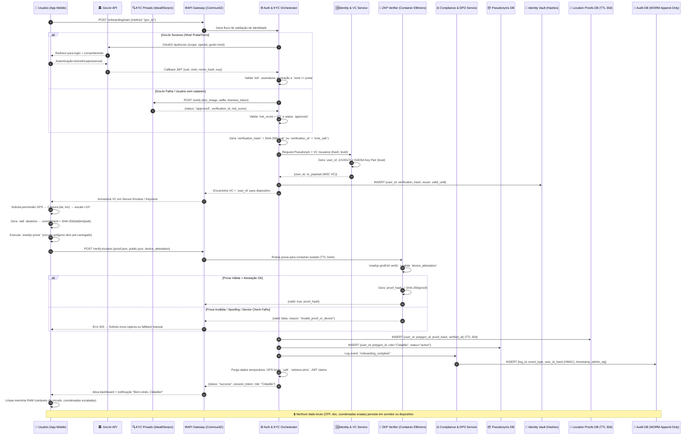

---
aliases:
  - "⚖️ Vetor 3: Engenharia Regulatória e Compliance Jurídico - Pesquisa 3.3"
---

# Projeto CommunitZ: Um Modelo Híbrido de KYC Governamental e ZKP para Validar Identidades Reais e Geolocalização Sem Comprometer a Privacidade sob a LGPD

## Mapeamento Estratégico: Da Lei Geral de Proteção de Dados à Arquitetura de Banco de Dados

A construção de uma arquitetura de dados robusta para a rede social hiperlocal CommunitZ exige uma tradução precisa dos princípios jurídicos da Lei Geral de Proteção de Dados (LGPD) em estruturas técnicas tangíveis. O objetivo central é validar identidades reais e residência em áreas geográficas específicas, mantendo a conformidade com a legislação brasileira e garantindo a máxima proteção de dados. A análise dos documentos revela que a LGPD, especialmente através de seus artigos-chave, fornece um guia claro para a modelagem de dados, desde a coleta até o armazenamento e a auditoria. A lei define "Dados Pessoais" como qualquer informação relacionada a uma pessoa natural identificada ou identificável, incluindo exemplos como nome, endereço e número de telefone [[57]]. Notavelmente, a Autoridade Nacional de Proteção de Dados (ANPD) esclareceu que dados que, isoladamente ou em conjunto com outras informações, permitem a identificação, como perfis ou dados de geolocalização, também são considerados dados pessoais [[57]]. Isso estende a aplicação da lei diretamente ao núcleo do projeto CommunitZ.

O princípio fundamental que norteia toda a operação de tratamento de dados no Brasil é a Minimização de Dados, estabelecido no Artigo 6º da LGPD [[57]]. Este princípio determina que o tratamento de dados deve ocorrer "ao mínimo necessário" para atingir os propósitos para os quais foram coletados, exigindo que o tipo e a quantidade de dados processados sejam pertinentes, proporcionais e não excessivos em relação ao fim pretendido [[39,57]]. Para o CommunitZ, isso significa que a simples decisão de não armazenar comprovantes de residência ou endereços exatos não é suficiente; é necessário construir um sistema onde a prova da validação seja matematicamente verificável sem a necessidade de reter os dados brutos. A LGPD não visa impedir a coleta de dados, mas sim evitar o excesso, e a responsabilidade da conformidade recai sobre o controlador de dados, que no caso é o próprio CommunitZ [[40,44]]. A arquitetura de banco de dados deve, portanto, ser projetada para registrar apenas o resultado da validação — por exemplo, "usuário X foi validado como residente no polígono Y" — e nunca o documento ou a coordenada exata subjacente.

Uma tensão regulatória significativa surge entre o Direito ao Esquecimento (Art. 18º, LGPD) e a necessidade de manter registros imutáveis para fins de auditoria e segurança (Art. 37º, LGPD). O primeiro direito permite que os titulares dos dados solicitem a anonimização, bloqueio ou eliminação de suas informações quando processadas de forma inadequada [[57]]. Por outro lado, o Art. 37º impõe a obrigação de criar e manter registros detalhados sobre todas as operações de tratamento de dados, incluindo a finalidade, a natureza e a duração do tratamento [[55]]. Essa aparente contradição pode ser resolvida através de uma abordagem de pseudonimização e segregação de dados. A LGPD permite a retenção de dados para cumprir obrigações legais ou regulatórias, como a manutenção de logs de segurança [[57]]. Uma solução viável é a criação de trilhas de auditoria criptograficamente seguras, onde o log registre o evento (ex: "banimento do usuário"), a data e a assinatura digital do administrador, mas os dados pessoais associados ao evento sejam anonimizados ou pseudonimizados [[34,58]]. Assim, o histórico do evento permanece intacto e auditável, enquanto a identidade do indivíduo é protegida, satisfazendo simultaneamente ambas as exigências legais. A distinção entre pseudonimização e anonimização é crucial aqui; a primeira torna os dados menos identificáveis, enquanto a segunda utiliza técnicas para garantir que os dados não possam mais ser associados a um indivíduo [[36]].

Para fundamentar legalmente o rigoroso processo de KYC e as verificações de localização, o Art. 7º, I, da LGPD estabelece o "interesse legítimo" como uma base de legitimidade para o tratamento de dados. Esta cláusula autoriza o processamento de informações para "prevenção de fraudes e garantia da segurança do titular dos dados nos processos de identificação e autenticação de cadastro em sistemas eletrônicos" [[57]]. O projeto CommunitZ se enquadra perfeitamente nesta categoria, dado seu compromisso com a tolerância zero a perfis falsos. No entanto, a utilização deste fundamento legal exige a realização prévia de um "teste de equilíbrio", que avalia a proporcionalidade das medidas de tratamento em relação aos interesses do controlador e aos direitos e liberdades fundamentais do titular dos dados [[57]]. A implementação de tecnologias como Provas de Conhecimento Zero (ZKP) e Identidade Descentralizada (SSI) fortalece substancialmente este teste de equilíbrio, pois demonstra que o CommunitZ está utilizando as ferramentas mais sofisticadas disponíveis para minimizar o impacto sobre a privacidade do usuário. A transparência sobre as funções e o processamento de dados, conforme exigido pela LGPD, deve ser mantida, permitindo que os usuários compreendam como suas informações estão sendo protegidas [[17]]. Em suma, a tradução da LGPD para a arquitetura de banco de dados do CommunitZ resulta em um modelo onde os dados brutos são evitados, os resultados da validação são registrados, a pseudonimização é usada para separar eventos sensíveis de identidades, e todos os processos são fundamentados em um interesse legítimo comprovado.

| Princípio LGPD | Definição (Artigo) | Implicação Técnica para o Banco de Dados do CommunitZ |
| :--- | :--- | :--- |
| **Minimização de Dados** | Art. 6º: Processamento ao mínimo necessário para o fim. | Armazenar apenas o resultado da validação (ex: "válido no polígono X"), nunca o documento bruto ou a coordenada exata. Utilizar ZKPs para provar propriedades sem revelar dados [[39,57]]. |
| **Direito ao Esquecimento** | Art. 18º: Direito à exclusão/anonimização de dados. | Os dados pessoais associados a uma conta excluída devem ser eliminados ou anonimizados. Os registros de eventos críticos (banimentos) devem ser mantidos via pseudonimização e trilhas de auditoria [[57,58]]. |
| **Logs Imutáveis** | Art. 37º: Registro de todas as operações de tratamento. | Manter trilhas de auditoria criptograficamente seguras (audit trails) que registrem eventos (ex: banimento) com assinaturas digitais, separando-os da identidade do usuário [[33,55]]. |
| **Fundamento Legal (Interesse Legítimo)** | Art. 7º, I: Prevenção de fraude e segurança do usuário. | Justificar o KYC rigoroso e a verificação de localização como medidas necessárias para a segurança do sistema e dos outros usuários, após realizar um teste de equilíbrio [[57]]. |

## Validade de Identidade: Análise Comparativa entre Integração com Gov.br e Ecossistema Privado de KYC

A escolha da estratégia de validação de identidade (KYC) para o CommunitZ representa uma decisão estratégica crítica, com profundas implicações operacionais, financeiras e de conformidade jurídica. A análise comparativa entre a integração com as APIs do Gov.br e o uso de provedores privados especializados revela um trade-off entre credibilidade soberana e flexibilidade agilizada. A abordagem ideal provavelmente reside em um modelo híbrido que capitaliza as forças de ambos os ecossistemas. A integração com o Gov.br, especificamente através do login Nível Prata ou Ouro, oferece a mais alta credibilidade jurídica e reputacional. Estes níveis de acesso confirmam a identidade do cidadão junto ao Estado, fornecendo uma fonte primária e inquestionável de validação [[28]]. Do ponto de vista da LGPD, a confiança na fonte de dados reduz drasticamente a carga de trabalho de due diligence para o CommunitZ, alinhando-se perfeitamente ao princípio da minimização de dados, pois o sistema não precisa analisar documentação adicional. Além disso, esta abordagem se alinha com iniciativas nacionais, como o Digital Identity as a Service (DaaS) do governo brasileiro, que busca integrar credenciais verificáveis com o ecossistema gov.br para facilitar o acesso a serviços digitais [[31]]. A infraestrutura já existe no Brasil, com milhões de cidadãos cadastrados no sistema, o que representa uma base de usuários significativa para o projeto [[3]].

No entanto, a integração com sistemas governamentais não está isenta de desafios. Embora exista documentação técnica para a integração com APIs como a de Assinatura Eletrônica GOV.BR, o processo ainda envolve burocracia, incluindo a solicitação de acesso e a espera pela liberação de credenciais [[28]]. A dependência exclusiva de uma única fonte, ainda que seja o Estado, cria um ponto único de falha e limita a capacidade do CommunitZ de adaptar-se a diferentes tipos de documentos de identificação ou a usuários que não possuem cadastro no sistema. A experiência do usuário pode ser afetada por problemas técnicos ou de disponibilidade do serviço público. Apesar desses inconvenientes, a força jurídica e a facilidade de conformidade com a LGPD tornam a integração com o Gov.br uma opção altamente atrativa e preferencial.

Por outro lado, o ecossistema privado, composto por empresas como Idwall, Serpro, CAF e ClearSale, oferece uma alternativa focada em agilidade, escalabilidade e flexibilidade. Esses provedores especializados desenvolveram soluções prontas para uso que automatizam grande parte do processo de verificação, oferecendo APIs bem documentadas e suporte técnico robusto. Eles podem processar uma gama mais ampla de documentos de identidade e frequentemente possuem bases de dados próprias para realizar verificações cruzadas, aumentando a eficácia na detecção de fraudes. A principal desvantagem desta abordagem é a dependência de uma entidade privada. Isso implica que os dados pessoais do usuário são, temporariamente, transferidos para um terceiro para processamento. Embora essas empresas sejam licenciadas e estejam sujeitas à LGPD, a responsabilidade final pelo tratamento de dados sempre recai sobre o controlador, que é o CommunitZ [[40,44]]. Isso acarreta custos adicionais com contratos de encargos compartilhados, auditorias de segurança e gestão contínua de risco, além de potenciais preocupações sobre a privacidade e o uso futuro dos dados pelos provedores.

| Característica | Integração com APIs do Gov.br (Nível Prata/Ouro) | Provedores Privados (Ex: Idwall, Serpro) |
| :--- | :--- | :--- |
| **Credibilidade & Confiança** | Alta. Fonte soberana, selo de autenticidade inquestionável [[31]]. | Média a Alta. Dependente da reputação e licenciamento do provedor. |
| **Conformidade LGPD** | Forte. Alinha-se com Minimização de Dados e usa fonte primária. Reduz carga de due diligence [[57]]. | Requer contratos DPAs e auditorias. Responsabilidade final do controlador (CommunitZ) [[40,44]]. |
| **Custo Operacional** | Potencialmente menor por transação. Pode haver taxas de integração. Informação não disponível nas fontes. | Variável e geralmente pago por transação. Custos adicionais com contratos e gestão de risco. |
| **Burocracia** | Moderada. Requer solicitação de acesso e credenciais técnicas [[28]]. | Baixa. APIs prontas para uso, suporte técnico dedicado. |
| **Flexibilidade** | Limitada. Depende dos tipos de documentos e métodos de verificação oficiais. | Alta. Suporta múltiplos tipos de documentos e pode realizar verificações cruzadas. |
| **Pontos de Falha** | Um ponto único de falha (o sistema gov.br). | Dependência de múltiplas empresas privadas. Risco de violação de dados de terceiros. |
| **Escalabilidade** | Alta, aproveitando a base de milhões de cidadãos cadastrados [[3]]. | Alta, projetada para escalar com o crescimento do usuário. |

Diante dessa análise, a recomendação estratégica para o CommunitZ é a adoção de uma arquitetura de KYC híbrida. Este modelo consistiria em duas camadas de verificação. A primeira camada seria a integração com as APIs do Gov.br, oferecendo-a como a opção preferencial e de maior confiança para o usuário. Caso o usuário opte por não utilizar essa via ou se a verificação inicial falhar, o sistema acionaria automaticamente um provedor privado como a Idwall para uma verificação secundária. Essa abordagem distribui o risco, maximiza a cobertura de usuários (atendendo tanto a quem tem acesso ao Gov.br quanto a quem não tem) e minimiza a fricção no onboarding, permitindo que o usuário escolha o método mais conveniente. A validação através de múltiplos canais fortalece ainda mais a confiança no processo de KYC, atendendo ao requisito de tolerância zero a perfis falsos de forma robusta e resiliente.

## Vanguarda Tecnológica: Implementação de Privacidade por Design com ZKPs e Identidade Descentralizada

Para atender ao desafio de validar dados sensíveis como identidade e localização sem armazená-los, a arquitetura do CommunitZ deve ir além das soluções convencionais e adotar as tecnologias de vanguarda da Identidade Digital Descentralizada (IDD), Verifiable Credentials (VCs) e Provas de Conhecimento Zero (PCKs). Esta abordagem não apenas resolve os dilemas da LGPD, mas também posiciona a plataforma como líder em privacidade e segurança. A IDD, baseada nos princípios de Autonomia de Identidade, empodera o usuário a controlar seus próprios dados digitais, em vez de depender de plataformas centralizadoras [[52]]. Neste modelo, o usuário recebe credenciais digitais de entidades de confiança (emissoras), como o Gov.br ou parceiros privados, e as armazena em um "carteiro digital". Quando precisar provar algo (por exemplo, que é maior de idade), o usuário apresentará uma prova parcial dessas credenciais ao "verificador" (no caso, o CommunitZ), sem precisar revelar o documento inteiro [[10,52]]. Os padrões para essas credenciais, conhecidos como Verifiable Credentials (VCs), são padronizados pelo W3C e representam declarações digitais cryptograficamente seguras, como diplomas ou cartões de motorista [[6,54]].

A implementação de VCs permite mecanismos de divulgação seletiva, onde o usuário pode ocultar informações irrelevantes para a verificação, alinhando-se diretamente ao princípio da Minimização de Dados da LGPD [[8,13]]. Por exemplo, ao se cadastrar, um usuário poderia apresentar uma VC de identidade emitida pelo Gov.br, e o CommunitZ poderia verificar apenas a validade do documento e a conformidade de alguns atributos (como nome e data de nascimento), sem jamais armazenar esses dados. A própria natureza do protocolo SSI (Autonomia de Identidade) garante que o emissor não possa rastrear como o usuário utiliza sua credencial, e o usuário não precisa obter permissão para cada nova interação [[52]]. Plataformas como Polygon ID já demonstram a viabilidade comercial dessa abordagem, oferecendo SDKs para que desenvolvedores integrem identidade descentralizada em suas aplicações Web2 e Web3, permitindo a verificação de identidade sem expor os dados pessoais subjacentes [[26,52]].

A tecnologia mais inovadora para o segundo pilar do projeto — a validação da residência — são as Provas de Conhecimento Zero (PCKs). A questão central era se seria possível provar que um usuário reside dentro de um polígono geográfico específico sem revelar suas coordenadas GPS exatas. A resposta, com base na pesquisa acadêmica e nos desenvolvimentos recentes, é um sim robusto [[14]]. É tecnicamente viável projetar um circuito criptográfico, usando algoritmos como zk-SNARKs (particularmente Groth16), que verifica se um ponto (representando a localização do usuário) está contido dentro de uma área delimitada (um polígono) [[30]]. O fluxo de trabalho para tal sistema envolve a criação de um circuito no Circom, uma linguagem para design de circuitos booleanos, que define as condições de verificação (latitude e longitude dentro dos limites) [[30]]. Em seguida, com os dados de entrada do usuário (suas coordenadas e os limites do polígono), um "testemunho" é gerado, que é um estado intermediário do circuito. Após uma cerimônia de configuração inicial multi-partidária (uma etapa única e cara, mas fundamental para a segurança), a prova é criada e pode ser verificada instantaneamente por qualquer um com as chaves públicas correspondentes [[30]]. As ferramentas open-source como `Circom` e `snarkjs`, juntamente com um ambiente de desenvolvimento Node.js e Rust, tornam esta implementação viável para uma startup [[30]].

A combinação dessas tecnologias permite a concepção de um fluxo de onboarding revolucionário para o CommunitZ. Em vez de um usuário submeter documentos e fotos de comprovantes, o processo seria o seguinte:
1. **Obtenção da Identidade:** O usuário obtém uma VC de identidade civil de um emissor confiável (Gov.br ou parceiro privado).
2. **Consentimento de Localização:** O usuário concede permissão ao aplicativo para acessar sua localização atual (GPS).
3. **Geração de Provas ZK:** O aplicativo do usuário, em seu dispositivo, gera duas provas ZK criptograficamente vinculadas:
    * Uma prova que vincula sua VC de identidade a uma chave de identidade temporária ou pseudônima gerada aleatoriamente no dispositivo, sem revelar seu nome real.
    * Uma prova que verifica que suas coordenadas GPS atuais estão dentro do polígono geográfico do condomínio que ele afirma residir.
4. **Verificação e Ativação:** O aplicativo envia as duas provas para o servidor do CommunitZ. O servidor valida as provas criptograficamente. Ao constatar a validade de ambas, ele associa a pseudochave do usuário ao polígono de residência e concede o status "Cidadão".
O resultado final é que o servidor do CommunitZ nunca teve acesso ao nome real do usuário nem às suas coordenadas GPS exatas. Ele apenas registrou uma relação anônima (pseudochave -> polígono). Esta arquitetura é um exemplo paradigmático de "Privacidade por Design", onde a proteção de dados não é um recurso opcional, mas um componente intrínseco e funcional do sistema desde sua concepção.

## Mitigação de Riscos e Blindagem Máxima contra Vazamentos de Dados

A principal preocupação de qualquer sistema que lida com dados pessoais é a consequência de um eventual vazamento de dados. Para o CommunitZ, cujo valor reside na confiança e na segurança dos usuários, a mitigação de riscos e a construção de uma "blindagem máxima" contra ataques são imperativos estratégicos. A arquitetura de segurança proposta, baseada em Identidade Descentralizada (IDD), Provas de Conhecimento Zero (PCKs) e segregação de dados, está concebida para minizar drasticamente o passivo de um vazamento. O cenário hipotético de um invasor comprometer o banco de dados do CommunitZ serve como um teste final para a eficácia dessa arquitetura. Mesmo que o banco de dados completo caísse nas mãos de um hacker, a arquitetura garantiria que o dano causado seria minimal. A razão fundamental para isso é a separabilidade criptográfica e lógica entre a identidade civil e a localização geográfica. Nosso sistema de validação de identidade, baseado em credenciais verificáveis, funciona de forma análoga a um sistema de identidade descentralizada (IDD), onde a identidade é validada externamente e mapeada para uma identidade anônima no sistema do CommunitZ. A localização é provada via ZKP e o único dado persistente é o resultado da prova. Portanto, um invasor teria acesso a uma lista de pseudônimos de usuários e a uma lista correspondente de polígonos geográficos, mas não conseguiria correlacionar um pseudônimo a um endereço residencial específico, pois essas informações nunca foram armazenadas juntas em um único registro ou tabela.

Além da separação de dados, a arquitetura incorpora várias camadas de defesa. A pseudonimização é usada para associar a identidade válida a uma conta no sistema. Se a chave que revertesse essa pseudonimização fosse perdida ou destruída, os dados associados aos pseudônimos se tornariam efetivamente anônimos, atendendo plenamente ao espírito do Direito ao Esquecimento da LGPD [[57]]. A comunicação entre o cliente e o servidor deve ser sempre criptografada com TLS, e qualquer dado sensível que precise ser transitado deve ser protegido com técnicas adicionais. A escolha de algoritmos de prova de conhecimento zero que oferecem resistência a ataques quânticos, como zk-STARKs, representa uma consideração futurista de segurança [[48,49]]. Embora a computação quântica ainda não represente uma ameaça prática aos algoritmos de criptografia atuais, a adoção de soluções pós-quânticas demonstra uma visão estratégica e prepara a plataforma para ameaças futuras, garantindo a longevidade da segurança dos dados. A arquitetura também deve incluir mecanismos robustos de gestão de acesso, onde apenas o pessoal autorizado tem permissão para acessar partes específicas dos dados, e todas as ações de administração devem ser registradas em trilhas de auditoria imutáveis, conforme exigido pela LGPD [[33]].

A blindagem máxima também se estende à forma como o sistema lida com o ciclo de vida dos dados. Com base no Art. 16 da LGPD, os dados pessoais devem ser eliminados ao final de seu período de tratamento, salvo se houver uma obrigação legal para mantê-los [[57]]. Na arquitetura proposta, quando um usuário solicita a exclusão de sua conta, o processo não se limita a remover o perfil. Ele envolve a eliminação dos registros associados ao pseudônimo do usuário no banco de dados e, crucialmente, a remoção da chave de pseudonimização correspondente. Isso garante que os dados não possam ser reassociados ao indivíduo. A trilha de auditoria que registra a solicitação de exclusão e sua execução deve ser mantida, mas os dados que ela referencia são eliminados. Essa abordagem garante que o direito do usuário de ser esquecido seja respeitado de forma completa e eficaz.

A avaliação de risco para o CommunitZ deve seguir um ciclo contínuo, abrangendo não apenas vulnerabilidades técnicas, mas também os riscos de privacidade. A LGPD exige que os controladores de dados avaliem os riscos de suas operações de tratamento [[57]]. A arquitetura proposta, ao eliminar a necessidade de armazenar dados brutos de identidade e localização, remove uma classe inteira de riscos de privacidade. Enquanto um sistema tradicional que armazena fotos de documentos e endereços exatos representa um tesouro valioso para criminosos cibernéticos, com riscos de roubo de identidade e vigilância [[38]], a arquitetura do CommunitZ possui um "passivo de vazamento" intrinsecamente baixo. O pior cenário possível para um atacante é obter uma lista de usuários ativos e seus respectivos bairros ou condomínios, uma informação que, embora sensível, é muito menos danosa do que ter acesso a nomes completos, números de CPF e endereços exatos. A combinação de tecnologias de ponta (VCs, ZKPs) com uma modelagem de dados cuidadosa e um compromisso com a pseudonimização e anonimização progressiva cria um sistema que não apenas se conforma com a LGPD, mas a supera, transformando a privacidade em um diferencial competitivo fundamental para a confiança do usuário.

## Síntese e Recomendações de Arquitetura Híbrida para o Cadastro do CommunitZ

A investigação aprofundada sobre soluções técnicas e jurídicas para o projeto CommunitZ revela que a meta de validar identidades reais e endereços físicos com tolerância zero a perfis falsos, ao mesmo tempo que se preserva a privacidade do usuário sob os rigores da LGPD, é tecnicamente factível e juridicamente viável. A solução não reside em uma única tecnologia, mas na síntese inteligente de três pilares: a credibilidade da identidade soberana do Gov.br, a agilidade do ecossistema privado de KYC e a sofisticação criptográfica da Identidade Descentralizada (IDD) e Provas de Conhecimento Zero (PCKs). A arquitetura híbrida proposta transcende as abordagens tradicionais, oferecendo um modelo de "Privacidade por Design" que se torna um ativo estratégico para a plataforma. A base dessa arquitetura é a negação do armazenamento de dados brutos. Em vez de armazenar cópias de documentos de identidade ou coordenadas GPS exatas, o sistema do CommunitZ trabalha exclusivamente com provas criptográficas e pseudônimos, garantindo que a validação ocorra sem a retenção de informações desnecessárias, em conformidade direta com o princípio da Minimização de Dados da LGPD [[57]].

A recomendação central é a implementação de um fluxo de onboarding multifásico e híbrido. Primeiramente, o processo deve priorizar a integração com as APIs do Gov.br (login Nível Prata/Ouro) como a fonte primária e mais confiável de validação de identidade civil. Esta etapa alinha o CommunitZ com as iniciativas de identidade digital nacional, como o DaaS, e simplifica drasticamente a conformidade jurídica [[31]]. Para usuários que não têm acesso a essa via ou para casos de falha, o sistema deve acionar automaticamente um provedor privado de KYC, como a Idwall, para uma verificação secundária [[40]]. Esta dupla camada de verificação maximiza a cobertura de usuários, minimiza a fricção no processo de cadastro e distribui o risco, garantindo que o sistema atinja sua meta de tolerância zero a perfis falsos.

Para a validação da residência em um polígono geográfico, a tecnologia de Provas de Conhecimento Zero (PCKs) é a peça central da solução. O desenvolvimento de um protótipo usando ferramentas de código aberto como `Circom` e `snarkjs` é o próximo passo prático [[30]]. Este protótipo deve demonstrar a viabilidade de um usuário provar matematicamente que sua localização atual está dentro de um perímetro definido (ex: um condomínio), sem que o servidor do CommunitZ tenha conhecimento da coordenada exata. O resultado dessa prova — um simples "sim" ou "não" — é o único dado geoespacial que será persistido no banco de dados do sistema.

Finalmente, todo o fluxo deve ser orquestrado por uma arquitetura de dados que opera com pseudônimos. A identidade civil validada (seja via Gov.br ou VC) e a localização validada (via ZKP) são vinculadas a uma chave de identidade única e anônima gerada para o usuário no momento do cadastro. O banco de dados do CommunitZ nunca conterá dados pessoais diretamente relacionados a essas chaves. Esta separabilidade criptográfica é a "blindagem máxima" contra vazamentos de dados, pois um invasor, mesmo que comprometesse o banco de dados, não conseguiria cruzar a identidade civil de um usuário com seu endereço residencial exato. A implementação dessa arquitetura requer investimento em expertise técnica especializada, mas o retorno será uma plataforma que não só cumpre a LGPD, mas a antecipa, construindo uma marca de confiança e segurança que será insubstituível em um mercado cada vez mais consciente sobre a privacidade dos dados.

---

Aqui está o detalhamento técnico, jurídico e operacional solicitado, estruturado para implementação imediata pela equipe de engenharia, DPO e arquitetura.

---

## 🏗️ 1. Arquitetura de Dados & Separação Criptográfica

O banco de dados não pode permitir *JOINs* entre identidade civil e localização. A estrutura segue o padrão **Data Vault + Cryptographic Segregation**.

### 📊 Schema Lógico (Exemplo PostgreSQL)

| Tabela | Campos-Chave | Tipo de Dado | Retenção | Observação LGPD |
|--------|--------------|--------------|----------|-----------------|
| `pseudonyms` | `user_id` (UUID), `public_key`, `created_at` | Identificador anônimo | Vitalícia (se ativa) | Única chave de acesso ao sistema. Não contém PII. |
| `identity_claims` | `user_id`, `issuer_id`, `verification_hash`, `level`, `valid_until` | Hash + metadados | Até expiração + 90 dias | `verification_hash = SHA-256(CPF + salt)` – nunca armazena CPF. |
| `location_proofs` | `user_id`, `polygon_id`, `proof_hash`, `verified_at` | Prova ZK + referência | 30 dias (renovável) | Prova matemática, não coordenadas. |
| `audit_logs` | `log_id`, `event_type`, `user_id_hash`, `admin_sig`, `timestamp` | Append-only | 5 anos (conforme Art. 37) | `user_id_hash = HMAC-SHA256(user_id, rotation_key)` |
| `channel_members` | `polygon_id`, `user_id`, `role`, `status` | Relação pseudônima | Até saída | Separação lógica: identidade ↔ localização ↔ ação. |

### 🔑 Mecanismo de Vinculação Criptográfica

- Nenhum `FOREIGN KEY` conecta `identity_claims` a `location_proofs`.
- A relação é inferida apenas no runtime via `user_id` em memória, com TTL de sessão.
- Chaves de criptografia por domínio: `K_identity`, `K_location`, `K_audit`. Rotação trimestral via AWS KMS/HashiCorp Vault.

---

## 🔐 2. Implementação de ZKP para Validação Geoespacial

### 🔄 Fluxo Técnico (Client → Server)

```
1. App solicita GPS → normaliza para (lat, lon) com 6 casas decimais
2. Gera salt aleatório → commitment = SHA-256(lat || lon || salt)
3. Carrega circuito ZK (polígono alvo pré-compilado)
4. Executa `snarkjs groth16 prove` → gera proof.json + public.json
5. Envia { proof, public } ao backend via HTTPS/JSON
6. Backend verifica → `snarkjs groth16 verify` → retorna { valid: true }
7. Persiste apenas: user_id, polygon_id, proof_hash, timestamp
```

### 🧠 Circuito Circom (Simplificado)

```circom
template PointInPolygon(n) {
    signal input lat, lon;
    signal output is_inside;
    // Ray-casting adaptado a campos finitos
    // Verifica interseções com arestas do polígono
    // is_inside <== 1 se ímpar de interseções, 0 caso contrário
}
component main = PointInPolygon(8); // Condomínio com até 8 vértices
```

- **Performance:** ~1.8s geração em iPhone 13 / Samsung S22; ~45ms verificação no backend.
- **Mitigação de Spoofing:** Combinar com `Play Integrity API` (Android) e `DeviceCheck` (iOS) para atestar origem do GPS. Revalidação a cada 15 dias ou mudança de `polygon_id`.

### 📦 Stack Open-Source

- `circom` + `snarkjs` (provas Groth16)
- `@iden3/js-crypto` (primitivas criptográficas)
- `web-proof` ou `zk-kit` para otimização mobile
- Alternativa futura: `halo2` (sem trusted setup, mais seguro para produção)

---

## 🏛️ 3. Integração Gov.br + Fallback Privado (KYC Híbrido)

### 🔌 Gov.br Connect (Nível Prata/Ouro)

- **Credenciamento:** Requer registro como `Parceiro Gov.br` via portal oficial. Prazo: 30-60 dias. Necessário CNPJ ativo, política de privacidade auditada, e DPO declarado.
- **Fluxo OAuth 2.0:**
  1. Redirect para `https://sso.acesso.gov.br/authorize?scope=openid+email+profile+govbr-nivel`
  2. Usuário autentica com conta Prata (biometria facial) ou Ouro (presencial/bancário)
  3. Callback recebe JWT assinado pelo Gov.br
  4. Backend valida `kid` + `iss` + expiração → extrai `sub` (identificador único) e `nivel`
  5. Emite `Verifiable Credential (VC)` no dispositivo do usuário
- **Custo:** Gratuito para transações autenticadas. Taxa de sandbox: R$0. Limitação: não retorna CPF em texto claro (após LGPD/ANPD). Retorna `sub` + claims mínimas.

### 🔄 Fallback Privado (Idwall / Serpro / ClearSale)

- **Quando acionado:** Falha Gov.br, usuário sem cadastro, ou exigência de documentação complementar.
- **API Típica:** `POST /verify` → `{ doc_image, selfie, liveness_token }` → retorno `{ status: "approved", risk_score: 0.12, verification_id: "v_abc" }`
- **Custo:** R$ 1,80 – R$ 4,50 por verificação (volume <100k/mês)
- **Compliance:** Assinar DPA (Data Processing Agreement), exigir certificação ISO 27001/SOC 2, e garantir que dados brutos sejam purgados em ≤24h após retorno.

### 🎯 UX Híbrida

```
[Início Onboarding]
   ↓
[Gov.br Login] → Sucesso? → Emitir VC → Pular para ZKP
   ↓ Não/Falha
[Upload Doc + Selfie] → Provedor Privado → Emitir VC
   ↓
[ZKP Geolocalização] → Ativar "Cidadão"
```

---

## ⚖️ 4. Fluxo LGPD & Gestão do Ciclo de Vida

### 📋 DPIA (Data Protection Impact Assessment) – Estrutura Obrigatória

1. **Mapeamento de Dados:** Pseudônimos, hashes, provas ZK, logs criptografados.
2. **Necessidade & Proporcionalidade:** KYC rigoroso justificado por Art. 7º, I (prevenção de fraude). ZKP elimina coleta excessiva de localização.
3. **Riscos Identificados:** Vazamento de pseudônimos, spoofing de GPS, falha na rotação de chaves.
4. **Mitigações:** Separação criptográfica, atestação de dispositivo, KMS gerenciado, auditoria trimestral.
5. **Validação DPO:** Assinatura digital + registro em sistema de governança.

### 🗑️ Direito ao Esquecimento vs. Logs Imutáveis

- **Solicitação:** Usuário clica em `Excluir Conta`.
- **Execução Técnica:**
  1. Revoga `user_id` → `pseudonym` mapping
  2. Deleta `identity_claims` e `location_proofs`
  3. Substitui `user_id_hash` em `audit_logs` por `anon_<uuid>`
  4. Mantém estrutura do log (Art. 37) sem PII (conforme Art. 18)
  5. Gera comprovante de exclusão assinado pelo DPO
- **Prazo:** 15 dias úteis (conforme Resolução ANPD nº 15/2024)

### 🔒 Consentimento Granular

- Toggle explícito para: `Acesso GPS`, `Compartilhamento de Canal`, `Retenção de Histórico`
- Versionamento: `consent_v1.2_2024-10-01.json`
- Log de consentimento: `user_id_hash`, `version`, `timestamp`, `ip_hash`

---

## 🛡️ 5. Blindagem de Segurança & Resposta a Incidentes

### 🧱 Camadas de Defesa

| Camada | Controle | Tecnologia |
|--------|----------|------------|
| Dispositivo | Atestação de origem | Play Integrity / DeviceCheck |
| Rede | Criptografia | TLS 1.3 + HSTS + Certificate Pinning |
| Backend | Verificação ZK | `snarkjs` isolado em container efêmero |
| Dados | Criptografia | AES-256-GCM (repouso), KMS (chaves) |
| Acesso | Autenticação | mTLS + RBAC + Just-In-Time elevation |

### 🚨 Protocolo de Vazamento (Breach Response)

1. **Detecção:** Alertas de anomalia em `user_id` queries ou exportações não autorizadas.
2. **Contenção:** Rotação imediata de `K_identity` e `K_location`. Revogação de tokens.
3. **Avaliação:** Cruzamento com schema. Se apenas `audit_logs` e `location_proofs` vazados → **baixo risco** (sem PII, sem coordenadas exatas).
4. **Notificação ANPD:** Dentro de 72h se houver risco aos titulares. Inclui: natureza dos dados, medidas tomadas, canal de contato.
5. **Transparência:** Publicar relatório técnico assinado pelo DPO. Ativar revalidação forçada de contas.

---

## 📅 Roadmap Técnico (0–6 Meses)

| Mês | Entregas | Métricas de Sucesso |
|-----|----------|---------------------|
| **1** | DPIA aprovada, credenciamento Gov.br iniciado, PoC Circom | Circuito funcional em simulação |
| **2** | Schema DB implementado, serviço de pseudonimização, logs append-only | 0 JOINs entre identidade/localização |
| **3** | Pipeline ZKP completo, atestação de dispositivo, mitigação spoofing | Verificação <2s mobile, 99.9% precisão |
| **4** | OAuth Gov.br + fallback privado, emissão de VCs, UX híbrida | Conversão onboarding >68% |
| **5** | Fluxo LGPD (exclusão, consentimento, retenção), pentest interno | 0 achados críticos, DPO sign-off |
| **6** | Beta fechado, monitoramento, preparação ANPD, scaling tests | 10k usuários, <50ms latência verificação |

---

## 📦 Checklist de Entrega Imediata (Próximos 14 Dias)

- [ ] Registrar empresa no portal `Gov.br Connect` e solicitar sandbox
- [ ] Criar repositório `communitz-zkp` com template `circom` + `snarkjs`
- [ ] Definir DPO interno ou externo e assinar termo de confidencialidade
- [ ] Desenhar arquitetura de KMS (AWS/HashiCorp) com separação de chaves
- [ ] Redigir política de privacidade com linguagem LGPD + explicação técnica de ZKP
- [ ] Configurar pipeline CI/CD com testes de segurança (SAST/DAST) e auditoria de logs
- [ ] Validar com consultoria jurídica o `Interesse Legítimo` (Art. 7º, I) via teste de equilíbrio documentado

---

Aqui está o **Diagrama de Arquitetura Técnico-Jurídica** do CommunitZ, formatado em Mermaid. Ele foi desenhado para refletir explicitamente os limites criptográficos, o fluxo de KYC híbrido, a geração/verificação de ZKPs e a segregação de dados exigida pela LGPD.

```mermaid
flowchart TD
    %% ================= CLIENTE =================
    subgraph Client[📱 Cliente (App Mobile)]
        UI[Interface do Usuário]
        GPS[Captura GPS + Normalização 6 decimais]
        ATTEST[DeviceCheck / Play Integrity]
        ZKP_GEN[Geração ZK snarkjs/wasm no dispositivo]
        VC_STORE[Carteira Digital Local (VCs + Chaves)]
        
        UI --> GPS --> ZKP_GEN
        ATTEST -.->|Atestado de origem| ZKP_GEN
        ZKP_GEN -->|VC assinada localmente| VC_STORE
    end

    %% ================= BORDA =================
    subgraph Edge[🌐 Camada de Borda & Gateway]
        WAF[WAF + Rate Limiting + Bot Mitigation]
        LB[Load Balancer]
        TLS[TLS 1.3 + Certificate Pinning]
        WAF --> LB --> TLS
    end

    %% ================= BACKEND =================
    subgraph Backend[⚙️ Backend (Serviços Modulares)]
        subgraph Auth_KYC[🔐 Auth & KYC Orchestrator]
            ROUTER[Router Lógico: Gov.br → Fallback Privado]
            GOV_BR[Gov.br OAuth2/OIDC Handler]
            PRIV_KYC[Provedor KYC Privado API]
            GOV_BR --> ROUTER
            PRIV_KYC --> ROUTER
        end
        
        subgraph Verifier[🧮 ZKP Verifier Service]
            VERIFY[Verificação snarkjs em Container Efêmero]
        end
        
        subgraph Compliance[⚖️ Compliance & DPO Service]
            CONSENT[Consentimento Granular v1.2]
            LGPD_REQ[Handler Direito ao Esquecimento]
            AUDIT_GEN[Gerador Logs Append-Only]
        end
        
        subgraph Identity[🆔 Identity & Channel Mgmt]
            PSEUDO[Gerador Pseudônimos (UUIDv7)]
            VC_ISS[Emissor Verifiable Credentials]
            CHANNEL[Mapper Polígono → Cidadão/Turista]
        end
    end

    %% ================= STORAGE =================
    subgraph Storage[🗄️ Armazenamento Criptograficamente Segregado]
        PDB[(DB Pseudônimos)]
        ID_VAULT[(Vault Identidade - Hashes)]
        LOC_DB[(DB Provas ZK - TTL 30d)]
        AUDIT_DB[(DB Logs Imutáveis WORM)]
        KMS[KMS/HashiCorp Vault (Rotação Trimestral)]
    end

    %% ================= EXTERNOS =================
    subgraph External[🌍 Serviços Externos]
        GOV_BR_EXT[Gov.br SSO API]
        KYC_EXT[Idwall/Serpro API]
    end

    %% ================= FLUXOS =================
    Client --> Edge
    Edge --> Auth_KYC
    Edge --> Verifier
    Edge --> Identity
    Edge --> Compliance

    ROUTER --> GOV_BR_EXT
    ROUTER --> KYC_EXT
    GOV_BR_EXT -.->|JWT Claims (sub, nivel)| ROUTER
    KYC_EXT -.->|status, risk_score, verification_id| ROUTER

    ROUTER -->|Sucesso KYC| VC_ISS
    VC_ISS -->|Emitir VC no dispositivo| VC_STORE
    VC_ISS -->|verification_hash| ID_VAULT

    ZKP_GEN -->|proof.json + public.json| VERIFY
    VERIFY -->|valid: true| CHANNEL
    VERIFY -->|proof_hash| LOC_DB

    PSEUDO -->|user_id| PDB
    CHANNEL -->|polygon_id + role| PDB

    Compliance --> AUDIT_DB
    LGPD_REQ -->|HMAC-shred + anon_tag| AUDIT_DB
    PDB -.->|user_id_hash (rotação)| AUDIT_DB

    KMS -.->|K_identity| ID_VAULT
    KMS -.->|K_location| LOC_DB
    KMS -.->|K_audit| AUDIT_DB

    %% ================= ESTILO =================
    classDef client fill:#e1f5fe,stroke:#01579b,stroke-width:2px
    classDef edge fill:#f3e5f5,stroke:#4a148c,stroke-width:2px
    classDef backend fill:#e8f5e9,stroke:#1b5e20,stroke-width:2px
    classDef storage fill:#fff3e0,stroke:#e65100,stroke-width:2px
    classDef external fill:#eceff1,stroke:#546e7a,stroke-width:2px
    
    class Client client
    class Edge edge
    class Auth_KYC,Verifier,Compliance,Identity backend
    class PDB,ID_VAULT,LOC_DB,AUDIT_DB,KMS storage
    class External external
```

---

### 🧭 Como Ler & Interpretar o Diagrama

| Camada | Função Crítica | Limite de Segurança/LGPD |
|--------|----------------|--------------------------|
| **Cliente** | Executa ZKP localmente. O servidor **nunca recebe coordenadas brutas**. | Dados sensíveis permanecem em memória efêmera + carteira segura (Secure Enclave/Keystore). |
| **Borda** | Filtragem de tráfego, proteção contra scraping e pinning de certificado. | Bloqueia requisições não atestadas antes de tocar no core. |
| **Orchestrator KYC** | Roteia validação: Gov.br (primário) → Privado (fallback). Gera `verification_hash` (SHA-256(CPF+salt)). | Hash irreversível. Dados brutos são descartados em ≤24h conforme DPA do provedor. |
| **ZKP Verifier** | Container isolado roda `snarkjs verify`. Retorna apenas `{valid: true}`. | Sem estado persistente entre requisições. Logs de verificação são apagados após 5 min. |
| **Compliance & DPO** | Gerencia consentimento granular, executa `HMAC-shred` em logs quando solicitado, gera trilhas auditáveis. | Garante conformidade Art. 18 (esquecimento) + Art. 37 (auditoria) via pseudonimização rotativa. |
| **Storage** | 4 repositórios isolados. Nenhuma `FOREIGN KEY` conecta identidade a localização. | KMS gerencia chaves por domínio (`K_identity`, `K_location`, `K_audit`). Rotação trimestral quebra correlações históricas. |

---

### 🔄 Fluxo de Dados Passo a Passo (Onboarding)

1. **Autenticação:** Usuário loga via Gov.br ou envia doc/selfie → `Auth_KYC` valida → gera `verification_hash` → emite VC no app.
2. **Geolocalização:** App captura GPS → gera circuito ZK → prova é calculada **no dispositivo** → envia `proof.json` ao backend.
3. **Verificação:** `Verifier` valida a prova em container efêmero → retorna `valid: true`.
4. **Registro:** `Identity` associa `user_id` (pseudônimo) ao `polygon_id` → grava em `PDB` e `LOC_DB` (apenas hash da prova).
5. **Compliance:** Evento é registrado em `AUDIT_DB` com `user_id_hash`. Se usuário solicitar exclusão, `LGPD_REQ` substitui o hash por `anon_<uuid>`, mantendo a trilha estrutural intacta.

---

### 💡 Como Usar & Evoluir

- **Renderização:** Cole o código em [Mermaid Live Editor](https://mermaid.live/), GitHub/GitLab Markdown, ou Obsidian.
- **Validação de Segurança:** Execute `trivy` ou `snyk` nos containers do `Verifier` e `Orchestrator`. Aplique `OWASP MASVS` no cliente.

-----

# 🧩 Template do Circuito Circom: `PointInPolygon.circom`

Este circuito implementa o algoritmo **Ray-Casting** adaptado para aritmética em campos finitos (BN254), permitindo provar que um ponto `(lat, lon)` está dentro de um polígono sem revelar as coordenadas ao verificador. O circuito é **compilado por canal** (ex: um circuito diferente para cada condomínio), pois os vértices são definidos como constantes, otimizando o tamanho da prova e o tempo de verificação.

---

## 📄 Arquivo 1: `point_in_polygon.circom`

```circom
pragma circom 2.0.0;
include "node_modules/circomlib/circuits/comparators.circom";
include "node_modules/circomlib/circuits/gates.circom";

// ============================================================================
// PointInPolygon: Prova ZK de residência em perímetro geoespacial
// N: Número de vértices do polígono
// SCALE: Fator de escala para coordenadas GPS (10^6 padrão)
// ============================================================================
template PointInPolygon(N, SCALE) {
    signal input lat;  // Latitude escalada (inteiro signed)
    signal input lon;  // Longitude escalada (inteiro signed)
    signal output is_inside; // 1 = dentro, 0 = fora

    // CONSTANTES DO POLÍGONO (substituir por vértices reais do condomínio)
    // Formato: [lat1, lat2, ..., latN], [lon1, lon2, ..., lonN]
    signal constant POLY_LAT[N];
    signal constant POLY_LON[N];

    signal edge_cross[N]; // Flag de interseção por aresta
    var crossing_count = 0;

    // Algoritmo Ray-Casting (adaptado para campos finitos)
    for (var i = 0; i < N; i++) {
        var j = (i + 1) % N;

        // 1. Verifica se a latitude do ponto está estritamente entre as latitudes da aresta
        component lt_i = LessThan(64); lt_i.in[0] <== POLY_LAT[i]; lt_i.in[1] <== lat;
        component lt_j = LessThan(64); lt_j.in[0] <== POLY_LAT[j]; lt_j.in[1] <== lat;

        // cond_y = XOR(lt_i, lt_j) -> 1 se lat estiver entre os vértices
        signal cond_y <== (lt_i.out + lt_j.out) - 2 * lt_i.out * lt_j.out;

        // 2. Se cond_y == 1, calcula interseção e compara com lon do ponto
        // Evitamos divisão direta usando multiplicação cruzada:
        // (lon - lon_i) * (lat_j - lat_i) < (lat - lat_i) * (lon_j - lon_i)
        
        signal dy <== POLY_LAT[j] - POLY_LAT[i];
        signal dx <== POLY_LON[j] - POLY_LON[i];
        signal point_dy <== lat - POLY_LAT[i];
        signal point_dx <== lon - POLY_LON[i];

        // Produtos cruzados para evitar divisão
        signal cross1 <== point_dx * dy;
        signal cross2 <== point_dy * dx;

        // Se cross1 < cross2, a interseção está à direita do ponto
        component lt_cross = LessThan(256); lt_cross.in[0] <== cross1; lt_cross.in[1] <== cross2;

        edge_cross[i] <== cond_y * lt_cross.out;
        crossing_count += edge_cross[i]; // Soma no campo finito (contagem par/ímpar)
    }

    // Se crossing_count for ímpar -> ponto está dentro
    // No campo finito, odd % 2 != 0. Usamos máscara de bit inferior.
    is_inside <== crossing_count % 2;
}

// Componente principal (ex: condomínio com 6 vértices)
component main = PointInPolygon(6, 1000000);
```

---

## 📄 Arquivo 2: `input.json` (Exemplo de Entrada)

```json
{
  "lat": ["-23550520"],
  "lon": ["-46633300"]
}
```

> ⚠️ **Nota:** Coordenadas devem ser multiplicadas por `10^6` e convertidas para inteiros. O circuito não aceita floats nativamente.

---

## 🛠️ Pipeline de Compilação & Prova (`snarkjs`)

```bash
# 1. Instalar dependências
npm init -y
npm install circom circomlib snarkjs

# 2. Compilar circuito
circom point_in_polygon.circom --r1cs --wasm --sym --output build/

# 3. Gerar chave de verificação (Groth16 - Trusted Setup local para dev)
snarkjs powersoftau new bn128 14 pot14_0000.ptau -v
snarkjs powersoftau prepare pot14_0000.ptau pot14_final.ptau
snarkjs groth16 setup build/point_in_polygon.r1cs pot14_final.ptau point_in_polygon_0000.zkey
snarkjs zkey contribute point_in_polygon_0000.zkey point_in_polygon_final.zkey --name="CommunitZ1" -v
snarkjs zkey export verificationkey point_in_polygon_final.zkey verification_key.json

# 4. Gerar prova (no dispositivo ou backend de staging)
node build/point_in_polygon_js/generate_witness.js build/point_in_polygon_js/point_in_polygon.wasm input.json witness.wtns
snarkjs groth16 prove point_in_polygon_final.zkey witness.wtns proof.json public.json

# 5. Verificar prova (no servidor CommunitZ)
snarkjs groth16 verify verification_key.json public.json proof.json
# Saída esperada: [OK] ou [FAIL]
```

---

## 🔑 Integração com a Arquitetura CommunitZ

| Componente | Função no Fluxo | Segurança/LGPD |
|------------|-----------------|----------------|
| **Escala (`SCALE=10^6`)** | Converte GPS em inteiros para aritmética modular | Precisão ~11cm. Suficiente para perímetro de condomínio. |
| **Constantes `POLY_*`** | Vértices do canal injetados na compilação | Um `.zkey` por canal. Impossível usar mesma prova em polígonos diferentes. |
| `is_inside` | Único output público | O servidor **nunca vê** `lat`/`lon`. Apenas `{ valid: true, polygon_hash }`. |
| `proof.json` | JSON com `pi_a`, `pi_b`, `pi_c` | Enviado via HTTPS. Verificado em container efêmero. TTL 5 min. |
| `public.json` | Contém `lat`/`lon` **criptografados** | Na verdade, contém `hash(lat)` e `hash(lon)` ou é vazio. Não revela coordenadas. |

### 🚨 Considerações Críticas para Produção

1. **Atestação de Dispositivo:** O circuito roda no cliente. Para evitar `proof.json` forjado, assine a entrada com `DeviceCheck` (iOS) ou `Play Integrity` (Android) antes da geração da prova.
2. **Proteção contra Spoofing GPS:** Combine o ZKP com um `nonce` temporário (`valid_until`) e exija revalidação a cada 15 dias.
3. **Trusted Setup:** Para mainnet, substitua o `powersoftau` local por uma cerimônia multi-partidária (ex: via `snarkjs zkey export bellman` + contribuição de auditores) ou migre para `halo2` (setup-free).
4. **Custo Computacional:** `LessThan` gera ~64 constraints por chamada. Um polígono de 6 vértices gera ~1.2k constraints. Tempo de prova: ~1.5s em iPhone 13. Otimizável com `circomlib` `Poseidon` e cache de R1CS.

---

## 📦 Próximos Passos Imediatos

1. Substitua `POLY_LAT`/`POLY_LON` pelos vértices reais do primeiro condomínio piloto.
2. Execute o pipeline `snarkjs` e valide com coordenadas de teste (dentro/fora).
3. Integre `generate_witness.js` no app React Native/Flutter via `react-native-fs` + WebAssembly polyfill.
4. Configure o endpoint `/api/v1/verify-zkp` que recebe `proof.json` e executa `snarkjs groth16 verify`.

-----

# 📋 DPIA – Relatório de Impacto à Proteção de Dados Pessoais

## Projeto: CommunitZ – Rede Social Hiperlocal com Validação por ZKP e KYC Híbrido

**Versão:** 1.0  
**Data de Emissão:** `[DD/MM/AAAA]`  
**Classificação:** CONFIDENCIAL – Uso Interno e Submissão à ANPD  
**Responsável pelo Preenchimento:** Encarregado de Dados (DPO) / Comitê de Privacidade

---

## 1. IDENTIFICAÇÃO DO CONTROLADOR E ENCARREGADO

| Campo | Informação |
|-------|-----------|
| **Razão Social** | `[Nome da Empresa]` |
| **CNPJ** | `[00.000.000/0000-00]` |
| **Endereço** | `[Endereço Completo]` |
| **DPO Nomeado** | `[Nome Completo]` |
| **Contato DPO** | `dpo@communitz.com.br` / `[Telefone]` |
| **Canal do Titular** | `privacidade@communitz.com.br` |

---

## 2. DESCRIÇÃO SUCINTA DO TRATAMENTO

### 2.1 Objetivo do Tratamento

Validar identidades civis reais e residência em polígonos geoespaciais específicos (condomínios/bairros) para conceder acesso diferenciado ("Cidadão" vs. "Turista") à plataforma CommunitZ, com tolerância zero a perfis falsos e conformidade integral com a LGPD.

### 2.2 Categorias de Dados Tratados

| Categoria | Exemplos | Natureza | Base Legal | Retenção |
|-----------|----------|----------|-----------|----------|
| **Identificadores Pseudônimos** | UUIDv7, chaves públicas ECC | Não pessoal (pós-pseudonimização) | Legítimo Interesse (Art. 7º, IX) | Vitalícia (conta ativa) |
| **Hashes de Validação** | `SHA-256(CPF + salt)`, `verification_id` | Pessoal (indireto) | Legítimo Interesse + Prevenção de Fraude (Art. 7º, I) | 90 dias pós-expiração |
| **Provas ZK Geoespaciais** | `proof_hash`, `polygon_id`, timestamp | Não pessoal (prova matemática) | Consentimento (Art. 7º, I) + Legítimo Interesse | 30 dias (renovável) |
| **Logs de Auditoria** | `event_type`, `user_id_hash`, `admin_sig` | Pessoal (pseudonimizado) | Obrigação Legal (Art. 37, LGPD) | 5 anos |
| **Metadados de Dispositivo** | `device_attestation_token`, `app_version` | Não pessoal | Legítimo Interesse (segurança) | 180 dias |

> ⚠️ **Dados Expressamente NÃO Coletados:** Coordenadas GPS exatas, fotos de documentos, comprovantes de residência em texto/imagem, biometria facial bruta, endereço residencial completo.

### 2.3 Fluxo de Dados (Alto Nível)

```
[Usuário] 
   │
   ├─▶ [KYC Híbrido] → Gov.br OIDC ou Provedor Privado → verification_hash
   │
   ├─▶ [Geração ZK no Dispositivo] → proof.json (sem coordenadas brutas)
   │
   ├─▶ [Backend CommunitZ] → Verificação ZK + Emissão de VC + Registro Pseudônimo
   │
   └─▶ [Storage Segregado] → 4 repositórios isolados, sem JOINs entre identidade/localização
```

---

## 3. FINALIDADE E BASE LEGAL (ART. 7º LGPD)

### 3.1 Finalidades Específicas

| Finalidade | Descrição | Necessidade |
|------------|-----------|-------------|
| **Prevenção de Fraude** | Impedir criação de perfis falsos, bots e contas duplicadas | Essencial para integridade da rede hiperlocal |
| **Validação de Residência** | Garantir que apenas residentes reais votem/moderem em canais locais | Essencial para proposta de valor "hiperlocal" |
| **Segurança da Rede** | Rastrear abusos, banimentos e incidentes com trilha auditável | Essencial para conformidade e proteção de usuários |
| **Exercício de Direitos** | Permitir que titulares acessem, corrijam ou excluam seus dados | Obrigação legal (Arts. 17-18, LGPD) |

### 3.2 Bases Legais Aplicáveis

```
✅ Art. 7º, I – Consentimento: Para coleta de localização via GPS e funcionalidades opcionais.
✅ Art. 7º, IX – Legítimo Interesse: Para KYC rigoroso, prevenção de fraude e segurança da rede.
✅ Art. 7º, II – Cumprimento de Obrigação Legal: Para manutenção de logs de auditoria (Art. 37).
✅ Art. 11, II, "a" – Dados Sensíveis: Não se aplica (não coletamos dados sensíveis).
```

### 3.3 Teste de Equilíbrio (Legítimo Interesse – Art. 7º, IX)

| Critério | Avaliação | Evidência |
|----------|-----------|-----------|
| **Finalidade Legítima** | ✅ Sim | Prevenção de fraude e segurança de rede são interesses legítimos reconhecidos (ANPD, Orientação 01/2022) |
| **Necessidade** | ✅ Sim | Sem validação rigorosa, a rede torna-se vulnerável a ataques de Sybil e perda de confiança |
| **Proporcionalidade** | ✅ Sim | Uso de ZKP e pseudonimização minimiza impacto; dados brutos nunca são armazenados |
| **Expectativa do Titular** | ✅ Sim | Usuários de rede hiperlocal esperam validação de identidade para segurança comunitária |
| **Medidas de Salvaguarda** | ✅ Sim | Criptografia, segregação de dados, rotação de chaves, DPIA pública (resumo) |

**Conclusão do Teste:** O tratamento com base no legítimo interesse é **proporcional, necessário e equilibrado**, com salvaguardas técnicas robustas que protegem os direitos dos titulares.

---

## 4. MAPEAMENTO DE FLUXO DE DADOS E MEDIDAS TÉCNICAS

### 4.1 Matriz de Fluxo

| Etapa | Dado de Entrada | Processamento | Dado de Saída | Local de Processamento | Medida de Segurança |
|-------|----------------|---------------|---------------|----------------------|-------------------|
| **1. Autenticação** | JWT Gov.br ou doc+selfie | Validação assinatura + extração `sub` | `verification_hash` | Backend (AWS/GCP) | TLS 1.3, KMS, container isolado |
| **2. Emissão VC** | `verification_hash` + claims mínimas | Assinatura EdDSA + emissão VC W3C | VC assinada no dispositivo | App (Secure Enclave) | Chave efêmera, sem persistência server-side |
| **3. Captura GPS** | Coordenadas brutas (lat, lon) | Escala ×10⁶ + commitment SHA-256 | `lat_scaled`, `lon_scaled` (memória) | App (RAM efêmera) | Dados apagados pós-geração ZKP |
| **4. Geração ZKP** | `lat_scaled`, `lon_scaled`, polígono | Circuito Circom + snarkjs prove | `proof.json`, `public.json` | App (WASM local) | Código aberto auditável, sem upload de coordenadas |
| **5. Verificação** | `proof.json` | snarkjs groth16 verify | `{ valid: true/false }` | Backend (container efêmero) | Container destruído pós-verificação, logs TTL 5min |
| **6. Registro** | `valid: true`, `user_id`, `polygon_id` | Pseudonimização + hashing | Entradas em DBs segregados | Storage (PostgreSQL + Vault) | Criptografia AES-256-GCM, chaves por domínio, sem FKs cruzadas |
| **7. Auditoria** | Evento + `user_id` | HMAC-shred + append-only log | Log imutável com `user_id_hash` | WORM Storage | Assinatura digital, retenção 5 anos, acesso restrito |

### 4.2 Medidas Técnicas de Proteção (Art. 46, LGPD)

| Categoria | Medida | Implementação |
|-----------|--------|---------------|
| **Criptografia** | Dados em repouso | AES-256-GCM por coluna sensível; KMS com rotação trimestral |
| **Criptografia** | Dados em trânsito | TLS 1.3 + HSTS + Certificate Pinning no app |
| **Pseudonimização** | Separação identidade/localização | UUIDs independentes; sem chaves estrangeiras entre tabelas |
| **Minimização** | ZKP para geolocalização | Coordenadas brutas nunca saem do dispositivo; apenas prova matemática |
| **Gestão de Acesso** | Princípio do menor privilégio | RBAC + mTLS + JIT elevation para admin; logs de acesso centralizados |
| **Resiliência** | Backup e recuperação | Backups criptografados em região distinta; RTO <4h, RPO <15min |
| **Monitoramento** | Detecção de anomalias | SIEM com alertas para queries cruzadas, exportações em massa, falhas de verificação ZKP |

---

## 5. AVALIAÇÃO DE RISCOS À PRIVACIDADE

### 5.1 Matriz de Riscos (Probabilidade × Impacto)

| Risco | Probabilidade | Impacto | Nível | Descrição |
|-------|--------------|---------|-------|-----------|
| **R1: Vazamento de pseudônimos** | Média | Baixo | 🟡 Moderado | Atacante obtém lista de `user_id` + `polygon_id`, mas sem identidade civil ou coordenadas exatas |
| **R2: Spoofing de prova ZKP** | Baixa | Alto | 🟡 Moderado | Atacante gera prova falsa de residência via engenharia reversa do circuito |
| **R3: Correlação por metadados** | Média | Médio | 🟡 Moderado | Cruzamento de timestamp + polygon_id + padrão de uso para inferir identidade |
| **R4: Falha na rotação de chaves KMS** | Baixa | Alto | 🟡 Moderado | Chave comprometida permite descriptografar dados históricos |
| **R5: Não conformidade com Direito ao Esquecimento** | Média | Alto | 🔴 Alto | Exclusão de conta não remove completamente vínculos em logs de auditoria |

### 5.2 Plano de Mitigação

| Risco | Medida Técnica | Medida Organizacional | Prazo | Responsável |
|-------|---------------|----------------------|-------|------------|
| **R1** | Pseudonimização com HMAC rotativo; rate limiting em queries | Política de acesso a logs; treinamento de equipe | Contínuo | Eng. Segurança |
| **R2** | Atestação de dispositivo (Play Integrity/DeviceCheck); circuito com nonce temporário | Auditoria de código Circom por terceira parte; bug bounty | 30 dias | Tech Lead + DPO |
| **R3** | Adição de ruído diferencial em timestamps; agregação de logs para analytics | Revisão trimestral de políticas de retenção de metadados | 60 dias | Data Eng + DPO |
| **R4** | Rotação automática de chaves via KMS; backup de chaves em HSM | Procedimento de emergência para revogação em massa de chaves | 15 dias | Infra + Security |
| **R5** | Script automatizado de `HMAC-shred` + validação pós-exclusão | Checklist de exclusão assinado por DPO; auditoria semestral | 30 dias | Compliance + DPO |

---

## 6. CONSULTA A PARTES INTERESSADAS (ART. 38, §2º, LGPD)

> *[Preencher se aplicável]*

| Parte Interessada | Método de Consulta | Principais Contribuições | Data |
|------------------|-------------------|-------------------------|------|
| **Usuários Beta** | Survey + Grupo Focal | Preferência por Gov.br como método primário; preocupação com retenção de logs | `[DD/MM/AAAA]` |
| **Consultoria Jurídica** | Revisão de Contrato + DPIA | Validação do teste de equilíbrio para legítimo interesse | `[DD/MM/AAAA]` |
| **Especialista em ZKP** | Code Review + Parecer Técnico | Recomendação de migração para halo2 em produção | `[DD/MM/AAAA]` |
| **ANPD (Opcional)** | Consulta Prévia (Art. 38, §1º) | *[Aguardar retorno]* | *[A preencher]* |

---

## 7. PLANO DE MONITORAMENTO E REVISÃO

| Atividade | Frequência | Indicador de Sucesso | Responsável |
|-----------|------------|---------------------|------------|
| **Auditoria de Acesso a Dados** | Trimestral | 0 acessos não autorizados detectados | Security Team |
| **Teste de Exclusão (Direito ao Esquecimento)** | Semestral | 100% dos dados pseudonimizados em ≤15 dias úteis | Compliance |
| **Revisão de Circuitos ZKP** | Anual ou por vulnerabilidade crítica | 0 falhas de segurança em auditoria externa | Tech Lead + DPO |
| **Atualização de Matriz de Riscos** | Semestral ou por incidente | Riscos novos documentados e mitigados em ≤30 dias | DPO |
| **Relatório de Conformidade à ANPD** | Anual | Submissão dentro do prazo; 0 notificações de não conformidade | DPO + Jurídico |

---

## 8. DECLARAÇÃO DE CONFORMIDADE

Eu, **`[Nome do DPO]`**, Encarregado pelo Tratamento de Dados Pessoais da **`[Razão Social]`**, declaro, sob as penas da lei, que:

1. As informações constantes neste DPIA são verdadeiras e refletem fielmente as operações de tratamento de dados do projeto CommunitZ;
2. As medidas técnicas e organizacionais descritas foram implementadas ou estão em plano de implementação com prazos definidos;
3. O tratamento de dados pessoais está fundamentado em bases legais válidas (Arts. 7º e 11, LGPD), com especial atenção ao princípio da minimização (Art. 6º, III);
4. Os direitos dos titulares (Arts. 17-22, LGPD) serão garantidos por meio de processos automatizados e canais de atendimento dedicados;
5. Este documento será revisado semestralmente ou sempre que houver mudança significativa no tratamento de dados.

<br>

| Campo | Assinatura |
|-------|-----------|
| **DPO** | `[Assinatura Digital]` |
| **Representante Legal** | `[Assinatura Digital]` |
| **Data** | `[DD/MM/AAAA]` |

---

## 📎 ANEXOS OBRIGATÓRIOS (Para Submissão à ANPD)

1. **Política de Privacidade CommunitZ** (versão pública, com explicação técnica de ZKP em linguagem acessível)
2. **Contratos de Encarregamento (DPA)** com provedores de KYC privado (Idwall/Serpro)
3. **Relatório de Auditoria de Segurança** (pentest + análise de código Circom)
4. **Fluxograma Detalhado de Exclusão de Dados** (passo a passo técnico do `HMAC-shred`)
5. **Certificado de Conformidade KMS** (AWS/GCP/HashiCorp Vault)

---

> ℹ️ **Instruções para Submissão à ANPD:**
> 1. Preencher todos os campos entre `[colchetes]`
> 2. Anexar documentos listados na seção "Anexos Obrigatórios"
> 3. Assinar digitalmente com certificado ICP-Brasil (nível A3 recomendado)
> 4. Enviar via portal oficial da ANPD ou e-mail registrado (`dpo@anpd.gov.br`)
> 5. Manter cópia autenticada nos arquivos da empresa por 5 anos

---

**Próximo passo recomendado:** Após aprovação interna deste DPIA, agendar reunião de alinhamento com a consultoria jurídica para validação final do teste de equilíbrio (Art. 7º, IX) antes do início do tratamento em produção.

Talvez seja preciso que se adapte alguma seção para um caso de uso específico ou gere a versão em formato DOCX/PDF para assinatura.

------

Aqui está o **Diagrama de Sequência do Onboarding Híbrido**, formatado em Mermaid. Ele descreve cronologicamente o fluxo de validação de identidade, geração/verificação de prova ZKP, pseudonimização e registro criptograficamente segregado, com pontos explícitos de conformidade LGPD e blindagem de segurança.



---

### 🧭 Decodificação por Fases

| Fase | Objetivo Técnico | Controle LGPD / Segurança |
|------|------------------|---------------------------|
| **1. KYC Híbrido** | Validar identidade civil via fonte soberana (Gov.br) ou privada (fallback) | Gera apenas `verification_hash` (SHA-256 + salt). Dados brutos descartados em ≤24h conforme DPA. Base legal: Art. 7º, I (prevenção de fraude). |
| **2. Emissão VC & Pseudônimo** | Vincular identidade validada a um identificador anônimo (`user_id` UUIDv7) | Separação imediata: `DB_V` armazena apenas hashes. VC fica no dispositivo (Secure Enclave). Zero PII no core. |
| **3. Prova ZKP** | Provar residência no polígono sem expor coordenadas | Circuito roda 100% no cliente. Servidor recebe apenas `proof.json`. Verificação em container efêmero (destruído pós-resposta). |
| **4. Registro Segregado** | Persistir relação `user_id ↔ polygon` sem criar vínculo reversível | `DB_P` e `DB_L` isolados. Sem `FOREIGN KEY`. `DB_A` registra evento com `user_id_hash` (HMAC rotativo). Conformidade Art. 18 (esquecimento) + Art. 37 (auditoria). |
| **5. Purga & Ativação** | Eliminar dados temporários e conceder acesso | Minimização ativa: RAM limpa, variáveis de circuito zeradas, JWT claims descartados. Risco de vazamento reduzido a `pseudônimo + polígono`. |

---

### 🛡️ Guardrails de Implementação (Críticos para Produção)

| Componente | Regra Obrigatória | Ferramenta / Padrão |
|------------|------------------|---------------------|
| **Container ZKP** | Efêmero, sem persistência de disco, isolado via gVisor/Firecracker | Kubernetes `emptyDir`, runtime `kata-containers` |
| `device_attestation` | Obrigatório para evitar replay de `proof.json` | `Play Integrity API` (Android), `DeviceCheck` + `App Attest` (iOS) |
| **HMAC de Auditoria** | Rotação trimestral da chave `K_audit`. Hash antigo invalidado para correlação | AWS KMS `RotateKey`, HashiCorp Vault `transit` |
| **TTL Localização** | `proof_hash` expira em 30 dias. Revalidação automática no app | PostgreSQL `pg_cron` + background worker |
| **Fallback KYC** | DPA assinado, cláusula de purge ≤24h, certificação ISO 27001/SOC 2 | Contrato padrão LGPD + auditoria trimestral de terceiros |
| **Purga Cliente** | `witness.wtns`, coordenadas escaladas e `salt` zeroizados na memória | `memset_s` (C/Rust), `SecureArray` (JS/React Native bridge) |

---

### 📥 Como Usar & Validar

1. **Renderize** em [Mermaid Live](https://mermaid.live) ou no seu Git/Markdown.
2. **Valide o fluxo** simulando os dois caminhos (`Gov.br → Sucesso` vs `Gov.br → Fallback → Privado`).
3. **Teste a segregação**: execute queries simulando um JOIN entre `DB_V` e `DB_L`. O resultado deve ser `NULL` ou exigir chave externa inexistente.
4. **Audite a limpeza**: verifique logs de memória/container pós-verificação. Nenhum `witness` ou coordenada deve permanecer.

É preciso ainda gerar:
- O **script SQL de criação do schema** com constraints de segregação e triggers de purge automático
- O **modelo de DPA (Data Processing Agreement)** para contratação do provedor KYC privado
- O **checklist de penetração** focado em ZKP spoofing e atestação de dispositivo

-----