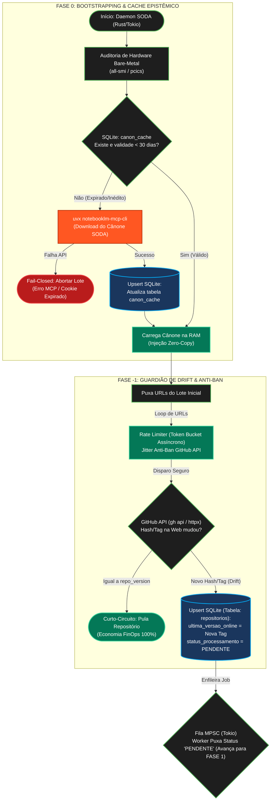
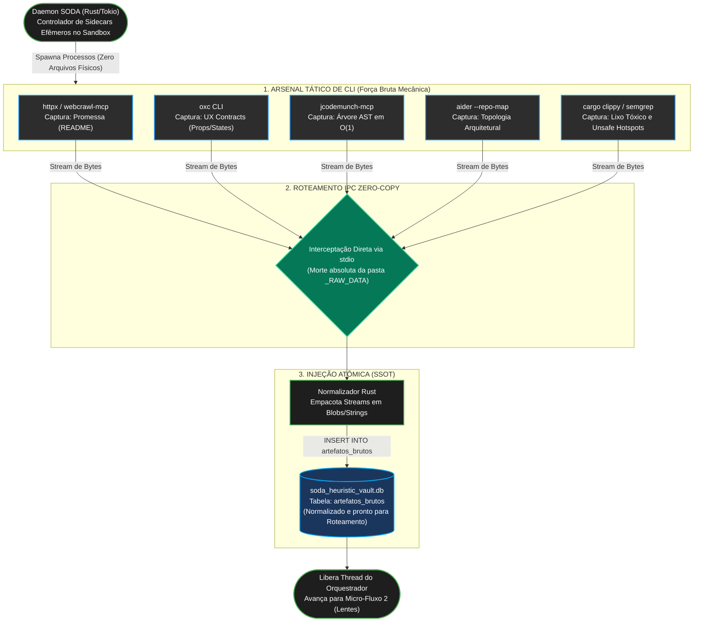
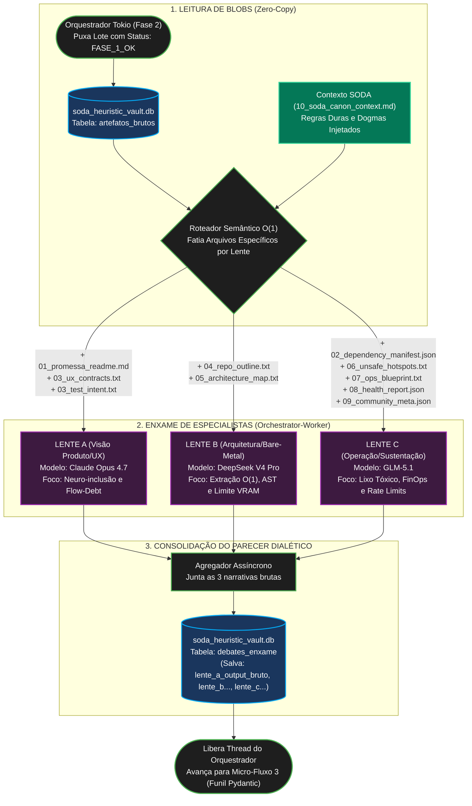
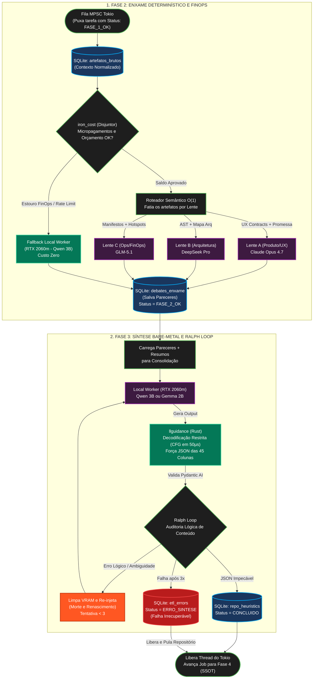
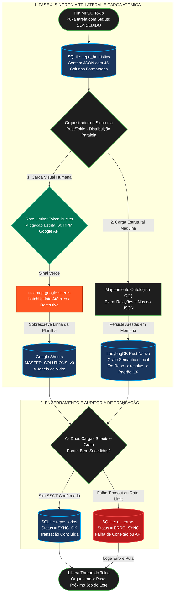
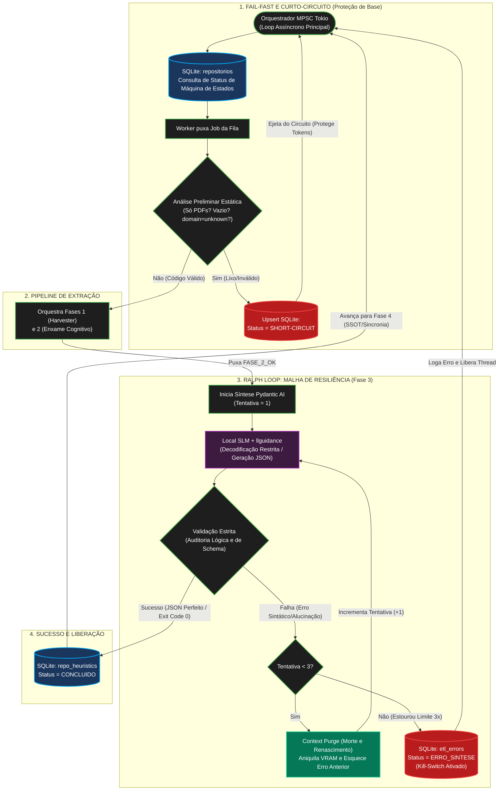

# SODA_V3_Topologia_Daemon_Orquestrador_Master

```mermaid
graph TD
    classDef skill fill:#ff5722,stroke:#bf360c,stroke-width:2px,color:#fff;
    classDef script fill:#1e1e1e,stroke:#4CAF50,stroke-width:2px,color:#fff;
    classDef raw fill:#2d2d2d,stroke:#2196F3,stroke-width:2px,color:#fff;
    classDef ai fill:#3d1a40,stroke:#9C27B0,stroke-width:2px,color:#fff;
    classDef db fill:#1a365d,stroke:#03A9F4,stroke-width:2px,color:#fff;
    classDef danger fill:#b91c1c,stroke:#ef4444,stroke-width:2px,color:#fff;
    classDef safe fill:#047857,stroke:#34d399,stroke-width:2px,color:#fff;

    A(["Início: Daemon SODA (Rust/Tokio)"])
    class A script;

    subgraph FASE_0 ["FASE 0: BOOTSTRAPPING & CACHE EPISTÊMICO"]
        HW_CHECK["Auditoria de Hardware<br>(all-smi / pcics)"]
        CANON_LOAD["uvx notebooklm-mcp-cli<br>(Download do Cânone SODA)"]
        DB_CANON[("SQLite: canon_cache<br>(Validade: 30 dias)")]

        class HW_CHECK,CANON_LOAD script;
        class DB_CANON db;

        A --> HW_CHECK
        HW_CHECK --> CANON_LOAD
        CANON_LOAD --> DB_CANON
    end

    subgraph FASE_MINUS_1 ["FASE -1: GUARDIÃO DE DRIFT & ANTI-BAN"]
        RATE_LIMIT["Token Bucket Assíncrono<br>(Prevenção de Ban no GitHub API)"]
        DRIFT_CHK{"Hash ou Tag Remota Mudou?"}
        SKIP(["Curto-Circuito: Pula Repositório<br>(Economia FinOps 100%)"])
        INS_PEND[("Upsert SQLite:<br>Status = PENDENTE")]

        class RATE_LIMIT,DRIFT_CHK script;
        class SKIP skill;
        class INS_PEND db;

        DB_CANON --> RATE_LIMIT
        RATE_LIMIT --> DRIFT_CHK
        DRIFT_CHK -->|"Igual"| SKIP
        DRIFT_CHK -->|"Novo ou Drift Detectado"| INS_PEND
    end

    LOOP{"ORQUESTRADOR MPSC (Tokio)<br>Consumidor de Tarefas Assíncronas"}
    class LOOP script;

    INS_PEND --> LOOP

    subgraph FASE_1 ["FASE 1: HARVESTER POLIGLOTA & ISOLAMENTO NATIVO"]
        RAMDISK["Aloca Ramdisk 2GB<br>(Protege SSD NVMe contra TBW)"]
        SANDBOX["Windows Sandbox (.wsb)<br>Partição Segura (Read-Only / Zero Egress)"]
        CLONE["Git Clone Blobless<br>Direto no Ramdisk isolado"]
        LANG_DETECT{"Roteador Poliglota<br>Detecta Stack Base"}

        GENERIC_EXT["JCodemunch (AST) / Aider / Manifestos"]
        RUST_EXT["cargo clippy / cargo test"]
        JS_EXT["npx oxlint / semgrep"]

        PURGE_SANDBOX["Process Pool Guard (RAII):<br>SIGKILL Sandbox & Desmonta Ramdisk"]

        TOK_COUNT{"Tiktoken Pre-Flight<br>(Contagem Isolada por Lente Alvo)"}
        DISTILL["Fase 1.5: Destilação Semântica<br>(Gemini Flash-Lite / Qwen)"]
        NORMALIZED_DB[("SQLite: artefatos_brutos<br>(Tabela Relacional Normalizada por Lente)")]

        class RAMDISK,SANDBOX,CLONE,LANG_DETECT,TOK_COUNT script;
        class GENERIC_EXT,RUST_EXT,JS_EXT raw;
        class PURGE_SANDBOX safe;
        class DISTILL ai;
        class NORMALIZED_DB db;

        LOOP -->|"Puxa PENDENTE"| RAMDISK
        RAMDISK --> SANDBOX
        SANDBOX --> CLONE
        CLONE --> LANG_DETECT

        LANG_DETECT -->|"Agnóstico"| GENERIC_EXT
        LANG_DETECT -->|"Rust"| RUST_EXT
        LANG_DETECT -->|"JS/TS"| JS_EXT

        GENERIC_EXT --> PURGE_SANDBOX
        RUST_EXT --> PURGE_SANDBOX
        JS_EXT --> PURGE_SANDBOX

        PURGE_SANDBOX --> TOK_COUNT

        TOK_COUNT -->|"> Limite Seguro (Ex: 128k)"| DISTILL
        DISTILL --> NORMALIZED_DB
        TOK_COUNT -->|"< Limite Seguro"| NORMALIZED_DB
    end

    subgraph FASE_2 ["FASE 2: ENXAME DETERMINÍSTICO & DISJUNTOR FINOPS"]
        FINOPS_BREAKER{"Disjuntor de Micropagamentos<br>(iron_cost) Orçamento OK?"}
        ROUTER_F2["Query Semântica O(1)<br>(Carrega apenas a Lente necessária da RAM)"]

        L1["Lente A (Produto/UX)<br>Claude Opus 4.7"]
        L2["Lente B (Arquitetura)<br>DeepSeek Pro"]
        L3["Lente C (Ops/FinOps)<br>GLM-5.1"]

        FALLBACK_LOCAL["Fallback Local Worker<br>(RTX 2060m - Qwen 3B)<br>Custo Zero"]

        DEBATE_DB[("SQLite: debates_enxame<br>Status: FASE_2_OK")]

        class FINOPS_BREAKER,ROUTER_F2 script;
        class L1,L2,L3,FALLBACK_LOCAL ai;
        class DEBATE_DB db;

        NORMALIZED_DB -->|"Puxa FASE_1_OK"| FINOPS_BREAKER
        FINOPS_BREAKER -->|"Estouro de Orçamento"| FALLBACK_LOCAL
        FINOPS_BREAKER -->|"Saldo OK"| ROUTER_F2

        ROUTER_F2 -->|"Manifestos/UX"| L1
        ROUTER_F2 -->|"AST/Topologia"| L2
        ROUTER_F2 -->|"Logs/Segurança"| L3

        L1 --> DEBATE_DB
        L2 --> DEBATE_DB
        L3 --> DEBATE_DB
        FALLBACK_LOCAL --> DEBATE_DB
    end

    subgraph FASE_3 ["FASE 3: SINTETIZADOR BARE-METAL & RALPH LOOP"]
        LOCAL_SLM["Local Worker (RTX 2060m)<br>Qwen 3B ou Gemma 2B"]
        LLGUIDANCE["llguidance (Rust)<br>Decodificação Restrita (CFG em 50µs)"]
        RALPH_LOOP{"Ralph Loop (Resiliência)<br>Auditoria Lógica de Conteúdo"}

        HEURISTIC_DB[("SQLite: repo_heuristics<br>Status: CONCLUIDO")]
        ERRO_SINTESE[("Status: ERRO_SINTESE<br>(Falha Irrecuperável)")]

        class LOCAL_SLM ai;
        class LLGUIDANCE,RALPH_LOOP script;
        class HEURISTIC_DB db;
        class ERRO_SINTESE danger;

        DEBATE_DB -->|"Puxa FASE_2_OK"| LOCAL_SLM
        LOCAL_SLM -->|"Gera Outputs Controlados"| LLGUIDANCE
        LLGUIDANCE -->|"Força Máscara JSON O(1)"| RALPH_LOOP

        RALPH_LOOP -->|"Erro Lógico (< 3 Tentativas)<br>Limpa VRAM e Tenta Novamente"| LOCAL_SLM
        RALPH_LOOP -->|"Sucesso (JSON Lógico e Perfeito)"| HEURISTIC_DB
        RALPH_LOOP -->|"Falha após 3 Tentativas"| ERRO_SINTESE
    end

    subgraph FASE_4 ["FASE 4: SINCRONIA TRILATERAL (SSOT)"]
        BATCH_SHEETS["mcp-google-sheets (Batch Update)<br>Preenche a Janela de Vidro"]
        LADYBUG["LadybugDB (Grafo 100% Rust)<br>Conecta Relacionamentos da Ontologia SODA"]
        SYNC_OK[("Status Final: SYNC_OK")]

        class BATCH_SHEETS,LADYBUG script;
        class SYNC_OK db;

        HEURISTIC_DB -->|"Puxa CONCLUIDO"| BATCH_SHEETS
        HEURISTIC_DB -->|"Puxa CONCLUIDO"| LADYBUG
        BATCH_SHEETS --> SYNC_OK
        LADYBUG --> SYNC_OK
    end

    SYNC_OK -->|"Libera Thread p/ Próximo Job"| LOOP
    ERRO_SINTESE -->|"Libera Thread p/ Próximo Job"| LOOP
```

# SODA_ETL_V3_DeepDive_Fases_0_e_Minus1_Guardiao

# SODA_ETL_V3_DeepDive_Fase1_Harvester_e_Sandbox

```mermaid
graph TD
    classDef skill fill:#ff5722,stroke:#bf360c,stroke-width:2px,color:#fff;
    classDef script fill:#1e1e1e,stroke:#4CAF50,stroke-width:2px,color:#fff;
    classDef raw fill:#2d2d2d,stroke:#2196F3,stroke-width:2px,color:#fff;
    classDef ai fill:#3d1a40,stroke:#9C27B0,stroke-width:2px,color:#fff;
    classDef db fill:#1a365d,stroke:#03A9F4,stroke-width:2px,color:#fff;
    classDef danger fill:#b91c1c,stroke:#ef4444,stroke-width:2px,color:#fff;
    classDef safe fill:#047857,stroke:#34d399,stroke-width:2px,color:#fff;

    START(["Fila MPSC Tokio<br>(Puxa tarefa com Status: PENDENTE)"])
    class START script;

    subgraph PREP ["1. PREPARAÇÃO BARE-METAL & RAMDISK"]
        RAMDISK["Aloca Ramdisk 2GB Dinâmico<br>(Evita desgaste TBW do SSD)"]
        class RAMDISK script;

        WSB_XML["Daemon Rust gera XML .wsb<br>(Configuração: Zero Egress / Read-Only)"]
        class WSB_XML script;

        CLONE["Git Clone Blobless<br>(--depth 1 --filter=blob:none no Ramdisk)"]
        class CLONE script;

        RAMDISK --> WSB_XML --> CLONE
    end

    START --> RAMDISK

    subgraph SANDBOX_ZONE ["2. WINDOWS SANDBOX (Isolamento de Execução)"]
        EXEC_WSB["Inicia Processo Isolado do Windows Sandbox"]
        class EXEC_WSB script;

        ROUTER{"Roteador Poliglota<br>(Detecta Stack Predominante)"}
        class ROUTER script;

        RUST_T["Trilha Rust<br>(cargo clippy, cargo test --list)"]
        class RUST_T raw;

        JS_T["Trilha JS/TS/Node<br>(npx oxlint, semgrep)"]
        class JS_T raw;

        GEN_T["Trilha Universal/Agnóstica<br>(JCodemunch AST, Extração de Manifestos)"]
        class GEN_T raw;

        EXEC_WSB --> ROUTER
        ROUTER -->|"Rust"| RUST_T
        ROUTER -->|"Node/JS"| JS_T
        ROUTER -->|"Universal"| GEN_T
    end

    CLONE --> EXEC_WSB

    subgraph PURGE ["3. EXTRAÇÃO PARA RAM & PURGA NUCLEAR"]
        EXTRACT_MEM["Daemon lê os arquivos .txt/.json gerados<br>direto para a Memória (VRAM/RAM)"]
        class EXTRACT_MEM raw;

        KILL_GUARD["Process Pool Guard (RAII)<br>Emite SIGKILL Atômico ao Sandbox"]
        class KILL_GUARD safe;

        UNMOUNT["Desmonta e Aniquila o Ramdisk<br>(Zero Lixo Deixado no Host)"]
        class UNMOUNT safe;

        RUST_T & JS_T & GEN_T --> EXTRACT_MEM
        EXTRACT_MEM --> KILL_GUARD --> UNMOUNT
    end

    subgraph NORMALIZATION ["4. PRE-FLIGHT & NORMALIZAÇÃO NO SQLITE"]
        TIKTOKEN{"Tiktoken Pre-Flight<br>(Calcula Tokens de forma isolada por Lente)"}
        class TIKTOKEN script;

        DISTILL["Fase 1.5: Destilação Semântica<br>(Qwen Local ou Flash-Lite resume a sujeira)"]
        class DISTILL ai;

        DB_INSERT[("SQLite: artefatos_brutos<br>(Salva Normalizado: repo_id, lente_alvo, conteudo_blob)")]
        class DB_INSERT db;

        DB_UPDATE[("SQLite: repositorios<br>(Altera Status_Processamento = FASE_1_OK)")]
        class DB_UPDATE db;

        UNMOUNT --> TIKTOKEN
        TIKTOKEN -->|"> Limite Limpo (Ex: 128k)"| DISTILL
        DISTILL --> DB_INSERT
        TIKTOKEN -->|"< Limite Limpo"| DB_INSERT
        DB_INSERT --> DB_UPDATE
    end

    NEXT_PHASE(["Libera Thread do Tokio<br>Avança Job para Fase 2 (Enxame)"])
    class NEXT_PHASE script;

    DB_UPDATE --> NEXT_PHASE
```

# SODA_ETL_V3_MicroFluxo_1_Arsenal_Tatico_RAW

# SODA_ETL_V3_MicroFluxo_2_Roteamento_Lentes

# SODA_ETL_V3_DeepDive_Fases_2_e_3_Enxame_e_Sintese

# SODA_ETL_V3_MicroFluxo_3_Funil_Pydantic

```mermaid
graph TD
    classDef skill fill:#ff5722,stroke:#bf360c,stroke-width:2px,color:#fff;
    classDef script fill:#1e1e1e,stroke:#4CAF50,stroke-width:2px,color:#fff;
    classDef ai fill:#3d1a40,stroke:#9C27B0,stroke-width:2px,color:#fff;
    classDef db fill:#1a365d,stroke:#03A9F4,stroke-width:2px,color:#fff;
    classDef danger fill:#b91c1c,stroke:#ef4444,stroke-width:2px,color:#fff;
    classDef safe fill:#047857,stroke:#34d399,stroke-width:2px,color:#fff;

    START(["Orquestrador Tokio (Fase 3)<br>Puxa Lote com Status: FASE_2_OK"])
    class START script;

    subgraph INGESTAO ["1. LEITURA DO DEBATE DIALÉTICO"]
        DB_IN[("soda_heuristic_vault.db<br>Tabela: debates_enxame")]
        class DB_IN db;
        
        EXTRACT["Extrai Visões Opostas O(1)<br>(Lente A, Lente B, Lente C)"]
        class EXTRACT script;
        
        START --> DB_IN --> EXTRACT
    end

    subgraph FUNIL ["2. O FUNIL PYDANTIC & DECODIFICAÇÃO RESTRITA"]
        WORKER["Local Worker (RTX 2060m)<br>Qwen 2.5 3B ou Llama 3.2 3B"]
        class WORKER ai;

        LLGUIDANCE{"llguidance (Rust)<br>Aplica o Pydantic Schema em 50µs"}
        class LLGUIDANCE safe;

        SGR["Schema-Guided Reasoning (SGR)<br>Ordem de Geração Forçada"]
        class SGR script;

        TXT_GEN["1º: Campos Narrativos<br>justificativa_decisao, executive_verdict..."]
        class TXT_GEN ai;

        ENUM_GEN["2º: Enums e Scores Rígidos<br>classificacao_terminal, acao_de_canibalizacao..."]
        class ENUM_GEN ai;

        EXTRACT --> WORKER --> LLGUIDANCE
        LLGUIDANCE -->|"Valida Gramática no Nível do Token"| SGR
        
        SGR -->|"Obriga a IA a pensar antes de dar a nota"| TXT_GEN
        TXT_GEN -->|"Com base no texto, trava a classificação"| ENUM_GEN
    end

    subgraph CARGA ["3. CARGA ATÔMICA E JANELA DE VIDRO (52+ Colunas)"]
        DB_OUT[("soda_heuristic_vault.db<br>Tabela: repo_heuristics<br>(JSON Impecável e Estruturado)")]
        class DB_OUT db;

        MCP_SHEETS["mcp-google-sheets<br>Carga Atômica Batch Update"]
        class MCP_SHEETS skill;

        GS[("Google Sheets<br>Aba: MASTER_SOLUTIONS_v3")]
        class GS db;

        ENUM_GEN --> DB_OUT
        DB_OUT -->|"Sincronia SSOT"| MCP_SHEETS
        MCP_SHEETS -->|"Preenche as 52+ Colunas"| GS
    end

    NEXT(["Libera Thread do Orquestrador<br>Atualiza Status: CONCLUIDO"])
    class NEXT script;

    GS --> NEXT
```

# SODA_ETL_V3_DeepDive_Fase4_Sincronia_SSOT

# SODA_ETL_V3_DeepDive_Malha_Tokio_e_RalphLoop

