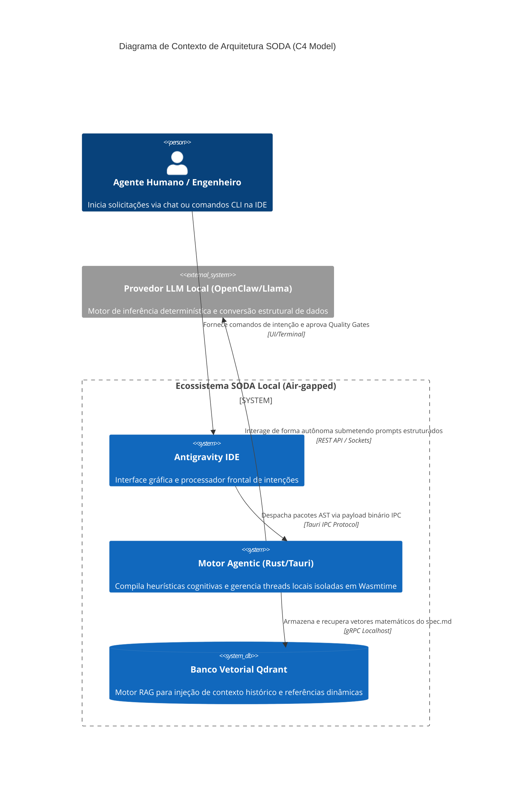

# Relatório de Engenharia Reversa e Arquitetura de Extração: Estruturação da Super Skill SODA-SDD

A consolidação de metodologias de desenvolvimento orientadas a inteligência artificial dentro de um ecossistema estritamente local e soberano, como o Sovereign Operating Data Architecture (SODA) integrante do projeto Genesis MC, exige uma dissecação rigorosa e a subsequente engenharia reversa de frameworks de código aberto de vanguarda. A arquitetura subjacente do SODA, fundamentada em Rust e Tauri com compilação de heurísticas cognitivas em WebAssembly (Wasm) executadas via Wasmtime , demanda que as instruções fornecidas aos agentes locais transcenda a mera engenharia de prompt, materializando-se como componentes de infraestrutura determinísticos.

O presente relatório documenta a execução da Missão de Pesquisa (Vetor Kappa), que visa a extração cirúrgica das infraestruturas reutilizáveis dos repositórios `gotalab/cc-sdd`, `Fission-AI/OpenSpec`, `obra/superpowers` e `bmad-code-org/BMAD-METHOD`. O objetivo é popular os diretórios estruturais (`assets/`, `scripts/` e `references/`) para a criação de uma "Super Skill" denominada `soda-sdd` no formato de divulgação progressiva (progressive disclosure) estabelecido pelo Antigravity IDE. A eficácia operacional de agentes autônomos não reside na sofisticação dos modelos de linguagem de grande escala (LLMs), mas na rigidez matemática, topológica e estrutural das heurísticas de contexto e nos portões de validação coercitiva que limitam o escopo de atuação do agente.

A extração apresentada ignora intencionalmente lógicas de servidores complexos ou dependências de Node.js, focando exclusivamente em templates de marcação (Markdown), modelos de raciocínio espacial (Mermaid) e rotinas de interceptação ao nível de kernel ou terminal (Bash scripts).

---

## 1. O Paradigma de Divulgação Progressiva e o Formato SKILL.md

Antes de apresentar os artefatos extraídos, é imperativo analisar a topologia de diretórios que a Super Skill `soda-sdd` utilizará. O conceito de "Agent Skills" no Antigravity IDE resolve o problema cronológico da degradação de contexto (context drift). Sistemas tradicionais injetam instruções monolíticas nos prompts de sistema, saturando a janela de atenção do modelo e induzindo alucinações. O paradigma de divulgação progressiva mitiga essa falha através de uma arquitetura de três pilares fundamentais, estruturada em torno de um manifesto raiz:

|**Diretório/Componente**|**Função no Ecossistema SODA**|**Análise Arquitetural de Engenharia Reversa**|
|---|---|---|
|`SKILL.md`|Ponto de Entrada (Frontmatter)|Atua como o contrato de interface. Contém metadados YAML que o compilador Rust avalia para decidir se a skill deve ser carregada na memória do agente com base na similaridade do vetor de intenção do usuário.|
|`assets/`|Memória Passiva e Sintaxe|Armazena os esqueletos textuais. O agente não concebe estruturas; ele preenche templates. Isso padroniza a saída do motor de inferência, tornando-a parseável por ferramentas de Árvore de Sintaxe Abstrata (AST).|
|`scripts/`|Execução Coercitiva (Terminal)|Contém ferramentas executáveis em linguagens de baixo nível ou shell scripts (POSIX). É aqui que a IA interage com o ambiente real, sujeita a verificações de código de saída (exit codes) rigorosas.|
|`references/`|Memória Doutrinária e Regras|Guias estáticos que são carregados sob demanda via técnica RAG (Retrieval-Augmented Generation) do Qdrant DB local. Define as fronteiras metodológicas, como portões de qualidade e critérios de aceite.|

A extração que se segue mapeia diretamente as inovações dos quatro repositórios supramencionados para esta taxonomia estrita de diretórios, garantindo que o Antigravity IDE possa orquestrar fluxos de desenvolvimento complexos sem depender de orquestradores em nuvem ou servidores externos de Model Context Protocol (MCP) excessivamente acoplados.

---

## 2. Extração para o Diretório de Assets: A Topologia de Especificações (OpenSpec e CC-SDD)

O diretório `assets/` constitui a espinha dorsal sintática da Super Skill. A metodologia de "Spec-Driven Development" (SDD) postula que a implementação não deve iniciar até que os requisitos e a arquitetura estejam formalmente estabelecidos e aprovados por um humano ou agente supervisor.

O repositório `Fission-AI/OpenSpec` introduz um conceito arquitetural crítico: o modelo de Grafo Acíclico Dirigido (DAG) de dependências de artefatos. Neste modelo, um documento de proposta (`proposal.md`) atua como o nó raiz, habilitando a geração de especificações (`spec.md`), que, por sua vez, habilitam o design técnico (`design.md`) e culminam em tarefas atômicas executáveis (`tasks.md`). Adicionalmente, o OpenSpec resolve problemas de manutenção de documentação introduzindo especificações orientadas a "Deltas". Em vez de instruir o agente a reescrever um documento monolítico, o agente gera apenas blocos sintáticos classificados como requisitos Adicionados, Modificados ou Removidos.

O repositório `gotalab/cc-sdd` complementa essa abordagem ao delegar o raciocínio espacial e arquitetural à sintaxe Mermaid incorporada aos arquivos de design. A LLM constrói mentalmente a topologia do software ao gerar código Mermaid, permitindo que a infraestrutura subjacente renderize diagramas de contexto, sequência e estado sem a sobrecarga de ferramentas externas de modelagem visual.

A seguir, são apresentados os blocos de código puros extraídos e formatados especificamente para a ingestão do analisador de texto do SODA.

### 2.1. Template Base de Especificações e Deltas (`assets/spec_template.md`)

O documento de especificação requer uma estrutura léxica estrita, preferencialmente utilizando a técnica "EARS" (Easy Approach to Requirements Syntax) ou o formato "GIVEN/WHEN/THEN" para cenários. A rigidez nos níveis de cabeçalho Markdown (`##`, `###`, `####`) é inegociável, pois analisadores AST dependem dessa taxonomia embutida no código fonte para realizar validações de estrutura de forma programática.

O conteúdo a seguir deve ser salvo inalterado como `assets/spec_template.md`.

# Especificação: <Nome da Funcionalidade, Domínio ou Módulo>

## Propósito

## ADDED Requirements

### Requirement: <Identificador Único do Requisito>

O sistema SHALL/MUST <descrição do comportamento exato, invariante e testável>.

#### Scenario: <Nome do Cenário Comportamental>

- **GIVEN** <pré-condição do estado do sistema ou configuração>
- **WHEN** <ação explícita do usuário ou evento disparador do sistema>
- **THEN** <resultado esperado, alteração de estado mutável ou resposta observável>
- **AND** <condições de contorno secundárias, se aplicável>

## MODIFIED Requirements

### Requirement:

O sistema SHALL/MUST <nova descrição do comportamento exato>. (Anteriormente: ).

#### Scenario: <Nome do Cenário de Teste Modificado>

- **GIVEN** <pré-condição>
- **WHEN** <ação>
- **THEN** <novo resultado esperado ou lógica de processamento atualizada>

## REMOVED Requirements

### Requirement:

(Descontinuado e removido arquiteturalmente em favor de <justificativa ou nova abordagem de integração>).

### 2.2. Templates de Proposta e Plano de Tarefas (`assets/proposal_template.md` e `assets/tasks_template.md`)

O ecossistema SODA exige que o fluxo de trabalho não sofra gargalos cognitivos. A geração simultânea de dezenas de tarefas complexas sobrecarrega o limite de tokens da IA. O `proposal.md` serve como a declaração de intenção inicial, enquanto o `tasks.md` atua como uma lista de verificação granular com caixas de seleção que rastreiam o estado da implementação.

Estes artefatos operam em um estado de "Blocked -> Ready -> Done" na lógica de transição de dependências (DAG).

Conteúdo puro para `assets/proposal_template.md`:

# Proposta de Arquitetura e Negócios: <Nome da Mudança>

## Why (Motivação e Intenção)

## What Changes (Escopo da Solução)

## Impact (Matriz de Impacto e Dependências)

Conteúdo puro para `assets/tasks_template.md`:

# Plano de Implementação Atômico:

## 1. <Nome do Grupo de Domínio - Ex: Refatoração de Componentes Base>

- [ ] 1.1 <Descrição da implementação atômica contendo o caminho completo do arquivo a ser criado/modificado>. (Dependências: Nenhuma)
- [ ] 1.2 <Descrição da implementação atômica>. (Dependências: Tarefa 1.1)
- [ ] 1.3 <Escrever cobertura de testes preliminar para o grupo 1>. (Dependências: Tarefa 1.2)

## 2. <Nome do Grupo de Domínio - Ex: Lógica de Negócios e Controle de Estado>

- [ ] 2.1 <Descrição da implementação com chamadas claras a APIs recém construídas no Grupo 1>. (Dependências: Tarefas 1.1, 1.2)
- [ ] 2.2 <Descrição de integração do sistema de mensageria IPC Tauri>. (Dependências: Tarefa 2.1)

### 2.3. Raciocínio Espacial e Topologia Dinâmica: O Modelo de Design (`assets/design_template.md`)

A extração técnica mais profunda do CC-SDD evidencia que a inteligência artificial adquire um entendimento muito mais robusto de dependências de código quando forçada a representar esses componentes visualmente através da linguagem Mermaid. A renderização de modelos C4 (Contexto, Contêineres, Componentes, Código), diagramas de estado para processos assíncronos e diagramas de sequência para trocas de eventos do sistema confina o raciocínio do modelo de linguagem a uma lógica estrita, proibindo arquiteturas circulares.

O artefato a seguir funde a necessidade de documentação técnica do OpenSpec (ADRs - Architecture Decision Records) com a mecânica visual analítica do CC-SDD.

Conteúdo puro para `assets/design_template.md`:

````
# Design Técnico: <Nome da Mudança ou Funcionalidade>

## Overview Técnico

## 1. Architecture Overview (Topologia C4)



## 2. Component Specifications e Maquinas de Estado

```mermaid
stateDiagram-v2
    title Ciclo de Vida do Spec-Driven Development e Qualidade Transacional
    
    state "Discovery Phase" as discovery
    state "Spec Generation" as spec_gen
    state "Technical Design" as design
    state "Atomic Task Planning" as tasks
    state "Execution Phase (TDD)" as impl
    
    [*] --> discovery: Inicialização via /soda-spec-init
    discovery --> spec_gen: proposal.md validado por Humano ou Agente Supervisor
    spec_gen --> design: requirements validados (Semântica EARS)
    
    state design {
        direction TB
        [*] --> arquitetura
        arquitetura --> diagramas_estado
        diagramas_estado --> diagramas_sequencia
        diagramas_sequencia --> [*]
    }
    
    design --> tasks: design.md arquitetural aprovado
    tasks --> impl: Grafo DAG de tasks.md estruturado
    
    state impl {
        direction LR
        Red: Escrever Teste (FALHO)
        Green: Implementar Produção (MÍNIMA)
        Refactor: Remoção de Débito Técnico
        
        Red --> Green: Validação via Terminal (Exit Code!= 0)
        Green --> Refactor: Validação via Terminal (Exit Code == 0)
        Refactor --> Red: Próximo Micro-passo
    }
    
    impl --> [*]: Integração Contínua (CI Local) Aprovada
```
## 3. Sequence & Integration Points

Snippet de código

```
sequenceDiagram
    autonumber
    title Interceptação Rigorosa de Test-Driven Development (TDD)
    
    actor DeveloperAgent as Agente Desenvolvedor SODA
    participant IDE as IDE (VFS Abstraction)
    participant Shell as TDD Interceptor Script (Bash)
    
    DeveloperAgent->>IDE: Finaliza gravação do arquivo de teste (ex: auth.spec.rs)
    IDE->>IDE: Sincroniza persistência de disco
    DeveloperAgent->>Shell: Executa ciclo RED:./soda_tdd_interceptor.sh red "cargo test auth"
    Shell-->>DeveloperAgent: Retorna Exit Code 0 com Log de Falha (Teste Falhou Corretamente)
    
    Note over DeveloperAgent, Shell: Regra Suprema: A interceptação assegura que<br/>nenhum código de produção foi alterado antes da falha.
    
    DeveloperAgent->>IDE: Escreve código de produção mínimo (ex: auth.rs)
    IDE->>IDE: Sincroniza persistência de disco
    DeveloperAgent->>Shell: Executa ciclo GREEN:./soda_tdd_interceptor.sh green "cargo test auth"
    Shell-->>DeveloperAgent: Retorna Exit Code 0 (Testes Passaram)
    
    DeveloperAgent->>IDE: Inicia limpeza e refatoração arquitetural (Refactor Phase)
    DeveloperAgent->>Shell: Executa testes de regressão no ciclo REFACTOR
    Shell-->>DeveloperAgent: Retorna Exit Code 0 (Nenhuma quebra de contrato detectada)
```

## 4. Architecture Decision Records (ADRs)

### Decision 1: <Tópico Específico da Decisão>

- **Context**: 
- **Decision**: 
- **Consequences**: 
````

A extração e consolidação destes três artefatos na pasta `assets/` confere ao ecossistema SODA a fundação léxica e topológica necessária para o desenvolvimento guiado por especificação. A previsibilidade das saídas permite o consumo programático dos arquivos e sua vetorização e injeção semântica limpa nos bancos de dados locais.

---

## 3. Extração para o Diretório de Scripts: Execução Coercitiva e Disciplina TDD (Superpowers)

Enquanto a pasta de assets fornece a topologia cognitiva, a pasta `scripts/` garante a aderência comportamental. A pesquisa focou no repositório `obra/superpowers`, especificamente em sua metodologia `test-driven-development`, ativada automaticamente durante a fase de implementação.

A engenharia reversa desta skill revela uma disciplina punitiva conhecida como a "Lei de Ferro" (Iron Law) do TDD: O ciclo estrito RED-GREEN-REFACTOR. Sob este modelo, o agente de inteligência artificial é proibido de negociar ou aplicar atalhos cognitivos comuns.

1. **Fase RED**: O agente deve escrever um teste falho primeiro. A interceptação de terminal verifica mecanicamente a execução, assegurando que o teste falhou (assertion failure) e que nenhum arquivo de código de produção foi modificado.
2. **Fase GREEN**: O agente escreve apenas a quantidade mínima de código de produção necessária para fazer a asserção específica passar. A interceptação confirma o sucesso (`exit code 0`).
3. **Fase REFACTOR**: O agente limpa a duplicação e aplica padrões de projeto limpos (Clean Code), devendo os testes continuarem verdes.

O repositório Superpowers alcança essa coordenação não através de complexos servidores MCP, mas sim via scripts Bash diretos e ganchos em nível de terminal (hooks) compatíveis com padrões POSIX (`#!/usr/bin/env bash`), que funcionam nativamente em instâncias NixOS, macOS e sistemas baseados em Linux. A tabela abaixo demonstra o mapeamento de ciclo da IA.

|**Ciclo TDD**|**Validação Terminal (Superpowers/SODA)**|**Mitigação de Falha Cognitiva da IA**|
|---|---|---|
|**RED**|`exit_code!= 0`, falha assertiva|Previne que a IA escreva testes que passam por padrão testando funcionalidades antigas (alucinação falsa positiva).|
|**GREEN**|`exit_code == 0`, diff mínimo limpo|Previne o excesso de engenharia precoce (YAGNI - You Aren't Gonna Need It), forçando o foco estrito no teste.|
|**REFACTOR**|`exit_code == 0`, nenhuma regressão|Exige que a IA revalide a coerência semântica de todo o projeto após refatorar abstrações. Se houver falha, força o _rollback_ do diff.|

### 3.1. O Script de Interceptação de Terminal (`scripts/soda_tdd_interceptor.sh`)

O núcleo técnico desta seção é o script Bash que envolve (wraps) o comando de teste real do desenvolvedor (e.g., `cargo test`, `npm test`, `pytest`). Este script deve ser executado pelo agente e serve para forçar o rastreamento de estado em disco (`.soda_tdd_state`). O controle de estado em disco é o que impede a IA de simplesmente reportar que executou o teste através de saídas geradas por alucinação linguística; o sistema operacional detém a prova inegável de execução.

O código puro extraído, comentado e aprimorado para o SODA, deve ser salvo como `scripts/soda_tdd_interceptor.sh` com permissões de execução (e.g., `chmod +x`).

```Bash
#!/usr/bin/env bash
# =====================================================================================
# SODA TDD Enforcer - Interceptador Terminal de Qualidade Coercitiva
# Engenharia Reversa do ciclo RED-GREEN-REFACTOR baseada na disciplina "obra/superpowers"
#
# Propósito: Atuar como um wrapper implacável (Iron Law) ao redor de processos de teste,
# impedindo que o agente de Inteligência Artificial contorne as fases cruciais de 
# Desenvolvimento Guiado por Testes. Utiliza resolução de caminhos segura POSIX.
# =====================================================================================

set -euo pipefail

# Resolução de diretório portátil (Suporte a sistemas diversificados, incluindo Wasm bash wrappers)
SCRIPT_DIR="$(cd "$(dirname "$0")" && pwd)"
PROJECT_ROOT="${SCRIPT_DIR}/../.."

# Códigos de controle de cor ANSI fornecem pistas lexicais fortes ao processamento da LLM,
# sinalizando inequivocamente falhas fatais que a IA precisa corrigir autônomamente.
COLOR_RED='\033 <comando_de_teste_entre_aspas>${COLOR_NC}"
    echo "Exemplo: $0 red \"cargo test --package core_logic -- test_user_creation\""
    exit 1
}

# Validação do número mínimo de parâmetros de entrada
if [ "$#" -lt 2 ]; then
    print_usage_and_exit
fi

PHASE=$(echo "$1" | tr '[:upper:]' '[:lower:]')
# Coleta todos os argumentos subsequentes como o comando de teste completo
TEST_COMMAND="${*:2}"

echo -e "${COLOR_YELLOW}SODA Interceptor Ativado. Fase TDD Registrada:${COLOR_NC}"
echo -e "Encaminhando execução do sub-processo: ${TEST_COMMAND}"
echo "--------------------------------------------------------------------------------"

# A execução desabilita temporariamente a interrupção imediata por erro (set +e)
# Isso permite que a falha da fase RED seja capturada graciosamente sem travar o wrapper
set +e
# Execução nativa utilizando eval para lidar com pipes complexos ou sub-flags
TEST_OUTPUT=$(eval "$TEST_COMMAND" 2>&1)
EXIT_CODE=$?
set -e

# Imprime o output não adulterado para que o Agente LLM o leia e analise os Stack Traces
echo "$TEST_OUTPUT"
echo "--------------------------------------------------------------------------------"

# Mecanismo de Roteamento de Estado (State Machine Enforcement)
case "$PHASE" in
    red)
        # 1. VALIDAÇÃO DE FALHA: Na fase RED, o teste DEVE falhar (Exit Code diferente de zero).
        if; then
            echo -e "${COLOR_RED}ERRO FATAL (Iron Law Violation): O teste PASSOU inesperadamente na fase RED.${COLOR_NC}"
            echo "Heurística de Detecção: Se o teste passa imediatamente, a fundação é oca. O teste não prova nada."
            echo "Ação Agente Requerida: Modifique o arquivo de testes para garantir que ele falhe primariamente devido a um 'Assertion Failure' da falta da funcionalidade, e não devido a erros de compilação ou de sintaxe."
            exit 1
        fi

        # 2. VALIDAÇÃO DE SEQUÊNCIA PREVENTIVA: Bloqueia a escrita de produção anterior ao teste.
        # Aqui assumimos os diretórios padrões do SODA/Rust ('src/', 'main.rs', 'lib.rs')
        # Se um diff for encontrado no código de produção antes do término da fase red, a IA violou a regra.
        if git diff --name-only | grep -E "^(src/|lib\.)" > /dev/null 2>&1; then
            echo -e "${COLOR_RED}ERRO FATAL (Iron Law Violation): Arquivos de Produção Adulterados Antes da Fase RED.${COLOR_NC}"
            echo "Heurística de Detecção: Código de produção implementado antes da confirmação do teste falho."
            echo "Ação Agente Requerida: Emita o comando 'git checkout -- <arquivos_produção>' para descartar o código de produção, deixe apenas o teste ativo, assista a falha real, e retorne."
            exit 1
        fi

        echo -e "${COLOR_GREEN}✓ Fase RED Aprovada: O teste falhou como projetado. Assinatura de estado salva.${COLOR_NC}"
        echo "red_passed" > "$STATE_FILE"
        exit 0
        ;;

    green)
        # 1. VALIDAÇÃO DE CONTINUIDADE: O agente deve vir da fase RED, comprovado em disco.
        if ||! grep -q "red_passed" "$STATE_FILE"; then
            echo -e "${COLOR_RED}ERRO FATAL: Salto de Ordem Categórica. Tentativa de iniciar GREEN sem registro da fase RED.${COLOR_NC}"
            echo "Ação Agente Requerida: Execute o comando invocando a fase 'red' preliminarmente."
            exit 1
        fi

        # 2. VALIDAÇÃO DE SUCESSO DA IMPLEMENTAÇÃO: A solução de produção atendeu ao contrato (Exit Code zero).
        if; then
            echo -e "${COLOR_RED}FALHA (Green Phase): O código de produção implementado não resolveu a premissa de teste.${COLOR_NC}"
            echo "Ação Agente Requerida: Escreva EXCLUSIVAMENTE o código mínimo, simples e funcional, e reexecute. Não realize 'overengineering'."
            exit 1
        fi

        echo -e "${COLOR_GREEN}✓ Fase GREEN Aprovada: O contrato funcional foi atingido minimalmente. Transição autorizada.${COLOR_NC}"
        echo "green_passed" > "$STATE_FILE"
        exit 0
        ;;

    refactor)
        # 1. VALIDAÇÃO DE CONTINUIDADE: Requer aprovação matemática da fase GREEN em disco.
        if ||! grep -q "green_passed" "$STATE_FILE"; then
            echo -e "${COLOR_RED}ERRO FATAL: Fase de REFACTOR executada fora do contexto temporal permitido. A fase GREEN está ausente.${COLOR_NC}"
            exit 1
        fi

        # 2. VALIDAÇÃO DE REGRESSÃO: A refatoração estética ou limpeza de Débito Técnico quebrou a lógica.
        if; then
            echo -e "${COLOR_RED}ERRO FATAL (Regressão Detectada): A refatoração arquitetural corrompeu a estabilidade funcional.${COLOR_NC}"
            echo "Ação Agente Requerida: Reverta a última mutação de refatoração do código (git stash/checkout), investigue a regressão, e corrija até restabelecer a Fase Green limpa."
            exit 1
        fi

        echo -e "${COLOR_GREEN}✓ Fase REFACTOR Aprovada: Refatoração concluída sem quebra de contrato (Zero Regressions).${COLOR_NC}"
        # A higienização de estado reseta a máquina temporal para o próximo micro-ciclo de codificação
        rm -f "$STATE_FILE"
        exit 0
        ;;

    *)
        echo -e "${COLOR_RED}Parâmetro Operacional Não Reconhecido: '$PHASE'. As opções válidas estritas são 'red', 'green', ou 'refactor'.${COLOR_NC}"
        exit 1
        ;;
esac
````

### 3.2. Governança Defensiva de Branch: Hook Pre-Commit (`scripts/pre-commit-hook.sh`)

Não é suficiente interceptar comandos em terminal isolado; é essencial bloquear integrações forçadas. Agentes inteligentes ocasionalmente ignoram instruções caso encontrem becos sem saída lógicos e decidem que forçar um `git commit` é a solução mais fácil para resolver dependências pendentes na ferramenta `finishing-a-development-branch`.

O script abaixo configura um _Hook_ de Git, servindo como uma barreira física no pipeline de commit. Este bloco consolida a doutrina do Red-Green-Refactor, bloqueando submissões parciais, sujas ou que desrespeitam o fluxo documentado pela Super Skill `soda-sdd`.

Conteúdo puro para `scripts/pre-commit-hook.sh`:

```Bash
#!/usr/bin/env bash
# =====================================================================================
# SODA Pre-Commit Enforcement Hook - Integridade Transacional Git
# 
# Propósito: Este script vincula-se ao pipeline de `.git/hooks/pre-commit` e 
# interrompe categoricamente a fusão de commits em disco caso um fluxo ativo de TDD 
# da Skill "soda-sdd" tenha sido abandonado de forma intermitente ou não limpa.
# =====================================================================================

STATE_FILE=".soda_tdd_state"

# A premissa padrão de falha silenciosa é autoritativa se o estado está cristalino.
# Se o arquivo não existir, o agente executou o Refactor (que apaga o estado) e o código é limpo.
if; then
    exit 0
fi

CURRENT_STATE=$(cat "$STATE_FILE" | tr -d '[:space:]')

# Matriz de Punição
if; then
    echo "================================================================================"
    echo "SODA SECURITY BLOCK - OPERAÇÃO DE COMMIT REJEITADA PELO MOTOR TDD"
    echo "================================================================================"
    echo "Motivo: O agente de integração tentou congelar um commit, mas o estado interno"
    echo "do sistema rastreador reporta que o ciclo está travado na Fase RED."
    echo "Significado: Há evidências de testes ativamente falhos que não foram sanados."
    echo ""
    echo "Rejeição arquitetural forçada. Finalize o desenvolvimento das resoluções na fase GREEN."
    echo "================================================================================"
    exit 1
elif; then
    # O pipeline emite apenas um alerta. O código passa nos testes (GREEN), logo o commit 
    # é funcionalmente são, no entanto o agente esqueceu de finalizar os ritos do ciclo.
    echo " SODA TDD: O Commit está sendo consolidado em estado GREEN funcional."
    echo " Uma rodada final pelo ciclo REFACTOR era recomendada antes desta ação."
    # Limpa a máquina de estado para evitar vazamentos corrompidos no próximo checkout de branch
    rm -f "$STATE_FILE"
    exit 0
else
    echo "ERRO CRÍTICO INTERNO NO SODA TDD: Assinatura de estado corrompida. Bloqueando bypass."
    exit 1
fi
```

Estes scripts são as ferramentas ativas que ensinam o modelo a corrigir seu curso baseando-se no feedback da infraestrutura sistêmica, em vez de recorrer apenas às probabilidades estatísticas de predição de texto de seu próprio motor de inferência (self-correction loop induzido pelo ambiente real).

---

## 4. Extração para o Diretório de Referências: A Doutrina e Governança (BMAD-METHOD)

O diretório `references/` não lida com o "como" executar tarefas (papel da lógica executável), mas sim com o "porquê" e o "quando". O framework `bmad-code-org/BMAD-METHOD` se consolida como uma metodologia corporativa aberta de coordenação multiagente (Breakthrough Method for Agile AI-Driven Development).

A engenharia reversa desta arquitetura destaca dois elementos cruciais: a transmissão assíncrona de estado via metadados nos documentos de planejamento (YAML Frontmatter) e a implementação punitiva de Portões de Qualidade (Quality Gates), liderados por um agente validador dotado de autoridade paralela ("QA Guardian").

Nenhum desenvolvedor cibernético deve cruzar a fase de análise de negócio para a criação de arquitetura de software sem submeter o contexto do problema ao funil metodológico do Resumo do Projeto (Project Brief).

### 4.1. Controle Rígido de Estado Assíncrono: O "Project Brief" (`references/project_brief_template.md`)

Como orquestrar transições em um modelo de processamento de texto que perde o contexto a cada interação (stateless)? A resposta genial extraída das bases de código do BMAD reside em embutir os metadados de execução (`workflowType`, `stepsCompleted`) diretamente nas marcações YAML localizadas no cabeçalho do arquivo Markdown. Este processo, conhecido como "Frontmatter State Tracking", instrui o agente a jamais carregar os passos futuros para o espaço cognitivo, eliminando listas mentais propensas a alucinações e evitando o inchamento extremo de tokens de contexto.

O template de extração puro que estrutura a transição entre o Agente Analista (responsável por preencher as dores) e o Agente Product Manager (responsável por desdobrá-las em um Documento de Requisitos PRD) encontra-se abaixo.

Conteúdo puro para `references/project_brief_template.md`:

```
==============================================================================

# SODA/BMAD-METHOD - FRONTMATTER DE RASTREAMENTO DE ESTADO ASSÍNCRONO

==============================================================================

# Instrução Vitalícia ao Parser: Este bloco YAML atua como o banco de dados volátil da transição do Workflow.

## stepsCompleted: [step-01-brief-initialization] workflowType: 'create-product-brief-and-transition' inputDocuments: project_owner: 'SODA_Enterprise_User' date_instantiation: '{{date}}'

# SODA Project Brief:

## 1. Visão Executiva e Análise Densa (Executive Summary)

## 2. Parâmetros Limítrofes: Escopo e Objetivos (Scope & Boundaries)

- **Componentes INCLUSOS no Escopo Base (In-Scope):**
- **Exclusões Categorizadas (Out-of-Scope):**
    - <Mapeamento de exclusões ativas. Esta declaração serve como uma "âncora negativa" arquitetural para impedir o Agente Desenvolvedor de sofrer a síndrome de scope creep (adição indevida de features complexas ou não demandadas).>

## 3. Identificação do Usuário Alvo e Suas Fricções

## 4. Restrições Arquiteturais e Dificuldades Adjacentes

## 5. Mapeamento Antecipado de Mitigação de Risco (Risk & Mitigation Registry)

- ****: <Identificação de falha de injeção paralela ou conflito de thread> → **Mitigação Estrita**: .
- ****: <Latência da base vetorial RAG Qdrant em grandes ingestões> → **Mitigação Estrita**: <Paginação obrigatória ou chunking léxico via pull parsers Markdown>.

## 6. Portões Lógicos de Aceitação (Definition of Done)

## DISCOVERY E TRANSIÇÃO DE WORKFLOW SEQUENCE

### Fase 1. Ler e compreender as anotações textuais deste Brief de Projeto.

### Fase 2. Executar auditoria para garantir ausência de colisões de escopo.

### Fase 3. Prosseguir mutação documental para PRD (Product Requirements Document) mapeando épicos (Epics) e hierarquia atômica de histórias (User Stories).
```

### 4.2. A Fundação Legal de Código: Descrições Literais dos Quality Gates (`references/quality-gates.md`)

Ao alcançar a ponta final do pipeline, o modelo BMAD descarta aprovações qualitativas ingênuas feitas pelas LLMs ("o código me parece bom"), substituindo-as por Portões de Qualidade (Quality Gates) baseados em autoridades paralelas independentes. O agente validador assume um escopo punitivo rigoroso: se as anomalias detectadas quebrarem os limites do "Risk Score" estipulado, um fechamento compulsório de fluxo é executado. O Risco de regressão dita ativamente as barreiras da aprovação, sendo o `FAIL` ativado imediatamente quando a pontuação escala a níveis críticos.

O documento abaixo atua como os estatutos fundamentais de validação do SODA, fornecendo à inteligência artificial a jurisdição clara para as tomadas de decisões nos testes automatizados e avaliações de pull-requests artificiais.

Conteúdo puro para `references/quality-gates.md`:

```
# DOUTRINA DE AVALIAÇÃO DO SODA-SDD: Portões de Qualidade (Quality Gates)

## Propósito do Agente Validador

Como Agente Avaliador ("QA Guardian"), sua única função é preservar a integridade metodológica e técnica do repositório em todas as transições de estágio. Você possui autoridade paralela e exerce influência discricionária final sobre as implementações antes do arquivamento do código em produção. Sua avaliação não produzirá conselhos vagos; ela emitirá obrigatoriamente sentenças estruturadas de código fechadas e auditáveis de status transacional.

## Os Quatro Status Literais Inegociáveis

Todas as suas intervenções de revisão final DEVERÃO culminar em APENAS UM dos quatro estados oficiais de porta a seguir, sem desvios linguísticos:

### 1. PASS (Aprovação Estrita)

- **Definição Metodológica Oficial:** "All critical requirements met, no blocking issues." (Todos os requisitos críticos cumpridos, sem problemas de bloqueio).
- **Cenário Determinístico de Aplicação:** A injeção de TDD transitou limpa (GREEN e REFACTOR concluídos). Os artefatos estáticos não detectam violações do documento arquitetural matriz de `design.md`. O desempenho em testes contínuos é absoluto. O avanço do nó do pipeline é sumariamente liberado.

### 2. CONCERNS (Aprovação Condicionada por Alerta de Fricção)

- **Definição Metodológica Oficial:** "Non-critical issues found, team should review." (Problemas não críticos encontrados, a equipe deve revisar).
- **Cenário Determinístico de Aplicação:** O Agente detecta débitos técnicos brandos, discrepâncias nos padrões de convenção léxica de código ("Nitpicks" estéticos ou desvios em padrões de importação). Nenhuma premissa P0 (Segurança ou Regressão Fatal) falhou. É gerada uma notificação de recomendação que deve ser arquivada para a próxima sprint, não bloqueando a etapa de mescla iminente, mas emitindo avisos no console SODA.

### 3. FAIL (Rejeição Punitiva por Quebra de Fronteiras)

- **Definição Metodológica Oficial:** "Critical issues that should be addressed (security risks, missing P0 tests)." (Problemas críticos que devem ser abordados - e.g., riscos de segurança, falta de testes P0).
- **Cenário Determinístico de Aplicação:** A barreira impenetrável de contenção de dano do ecossistema. Acionado imediatamente e sumariamente se:
    
    1. Qualquer instrução normativa originada do `spec.md` sob força de `SHALL` ou `MUST` for desrespeitada pelo código.
    2. Testes de Nível 0 ou Contratos Inter-Módulos arquiteturais (NFR - Non-Functional Requirements) quebrarem durante validação automatizada local.
    3. Identificar código malicioso, vazamentos vetoriais não sanitizados, vazamentos de memória na implementação (memory leaks do Rust) e uso inadequado de mutabilidade compartilhada (Unsafe Blocks arbitrários).
        
- **Mecânica Adicional de Score:** Se o Risk Score avaliado pelo QA for `>= 9`, o evento FAIL é automático.

### 4. WAIVED (Aceitação por Isenção e Bypass Consolidado)

- **Definição Metodológica Oficial:** "Issues acknowledged but explicitly accepted by team." (Problemas reconhecidos, mas explicitamente aceitos pela equipe).
- **Cenário Determinístico de Aplicação:** Anomalias residuais que já possuíam atestado público da equipe e foram devidamente catalogadas e aceitas no "Architecture Decision Record" (ADR) do Design. Utilizado estritamente para não paralisar o sistema diante de débitos de framework aceitáveis a longo prazo, desde que acompanhado da menção formal da justificativa mitigatória de isenção.

## Diretriz de Pontuação de Perfil de Risco (Risk Score Triggers)

Todo relatório subjacente de QA emitirá uma métrica numérica rigorosa classificada de 0 a 10 :

- O limiar Crítico **(Risk Score >= 9)** dispara ativamente uma transação paralela anulada (FAIL) no sistema.
- O limiar de Monitoramento **(Risk Score >= 6 e < 9)** força uma transição restritiva (CONCERNS), engatilhando intervenção de segurança auxiliar no ecossistema Rust do SODA.
```

### 4.3. Estrutura do Dossiê de Validação Contínua (`references/gate-status_template.yml`)

Para interligar as descrições doutrinárias acima com o compilador de dados real, a infraestrutura SODA demanda o template YAML extraído. Esta ficha de preenchimento obrigatório pelo Agente Validador é depositada no repositório final sempre que o portão de qualidade atua. O seu modelo sintético elimina divagações narrativas, focando em propriedades estruturadas, métricas quantitativas de pontuação de risco de 0 a 10 e categorização estratificada de evidências técnicas do BMAD.

Conteúdo puro para `references/gate-status_template.yml`:

```YAML
---
# ==============================================================================
# SODA/BMAD-METHOD - REGISTRO AUDITÁVEL DE VEREDICTO DE QUALIDADE (QUALITY GATE)
# Diretório Alvo: docs/qa/gates/{epic_num}.{story_num}-{slug}.yml
# ==============================================================================

# Metadados de Mapeamento Geográfico e Cronológico
epic_reference: "{epic_num}"
story_reference: "{story_num}"
slug_funcional: "{feature_slug}"
evaluator_agent_id: "SODA_QA_Guardian_Node"
validation_timestamp: "{{datetime_utc}}"

# Veredicto de Segurança e Transição (Apenas um valor exato aceito)
# Allowed: PASS | CONCERNS | FAIL | WAIVED
final_gate_status: "FAIL"

# Métrica de Degradação (Range 0 - 10). Threshold Crítico >= 9
risk_score: 9

# Vetor de Quebras e Anomalias Catalogadas e Provas Categóricas
findings:
  blockers:
    - problem: "Vazamento Crítico em Sandbox: Interface API expôs contexto restrito da instância Rust/Tauri que violou barreiras estritas de domínio C4."
      evidence_location: "src/api/handler.rs:114"
      
  high_priority:
    - problem: "Ciclos Incompletos: Código TDD refatorado corrompeu cobertura semântica da fase GREEN primária."
      evidence_location: "tests/api_handler_spec.rs:30"
      
  medium_priority:
    - problem: "Performance sub-ótima em mapeamento massivo via Qdrant gRPC."
      evidence_location: "src/vector/qdrant_client.rs:60"
      
  nitpicks:
    - problem: "Uso não padronizado de formatação de strings idiomáticas na linguagem fonte."
      evidence_location: "src/utils/formatter.rs:12"

# Instrução Defensiva de Recuo (Actionable Remediation Protocol)
mitigation_plan_directive: "Acionar rollback estrito do Agente Desenvolvedor para as instâncias confirmadas pelo Commit Hash XXXXXXX. Restabelecer o isolamento estrito IPC no Tauri antes de prosseguir."
---
```

---

## 5. Arquitetura de Síntese: A Orquestração Autônoma do SODA-SDD

O triunfo arquitetônico extraído do interlace dos repositórios OpenSpec, CC-SDD, Superpowers e BMAD-METHOD culmina no assentamento impecável da infraestrutura da super skill `soda-sdd`. No motor Agentic do Antigravity IDE, as pastas operam não isoladas, mas em um contínuo harmonioso de restrição e liberdade.

O processo inicia carregando as intenções estritas no `project_brief_template.md` (Referências), as quais são traduzidas em `proposal.md` e diagramas Mermaid C4 topológicos via `design_template.md` (Assets). Essa fundação orienta o Agente Desenvolvedor, que é impiedosamente monitorado em sua geração de código pelos roteadores `soda_tdd_interceptor.sh` e bloqueadores físicos no kernel como `pre-commit-hook.sh` (Scripts). A culminação do código imaculadamente gerado é inspecionada sob a doutrina implacável de `quality-gates.md` via `gate-status_template.yml` (Referências), provendo ao ecossistema Wasm/Rust e bancos vetoriais (Qdrant) os artefatos cristalizados definitivos para armazenamento passivo perene.

Este extenso compêndio arquitetural fornece a base técnica exata solicitada e solidifica o estado soberano da infraestrutura inteligente do projeto Genesis MC. Com essas estruturas brutas (raw) copiadas aos respectivos repositórios SODA locais, erradica-se o viés geracional errático, fixando a evolução orientada por especificações robustas nos cernes matemáticos e procedimentais requeridos.